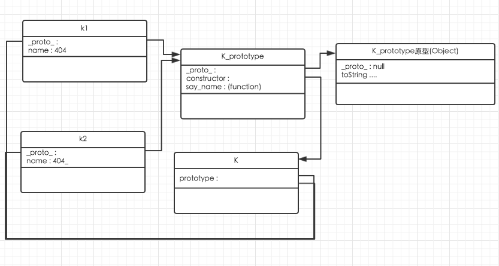

# 高性能javascript

# 1. 加载与执行

1. `<script>`每次出现,都会阻塞页面其他部分执行.
2. 页面在执行到`<body>`之前,不会有任何渲染页面的行为.
3. 建议所有`<script>`紧跟在`</body>`前面.
4. 尽可能减少`<script>`个数,用`Grunt`或`Gulp`来管理和压缩你的JS.
5. `<link>`后不要跟任何内嵌脚本.因为`<link>`会等待后面的内嵌脚本先执行.即使内嵌脚本在`<link>`之后
6. 无阻塞模式加载JS(延迟加载):推荐工具`YUI3`,`LazyLoad`,`LABjs`(比较喜欢这个,体积小,而且可以管理依赖关系,可以设置加载JS的有序/无序)


# 2. 数据读取

##1. 数据类型:

1. 字面量 : 字面量只代表本身,不存储在特定的位置,包括字符串,数字,数组,函数,null,undefiend等.
2. 本地变量 : var 定义的数据存储单元;
3. 数组元素 : js数组对象内部,以数字作为索引
4. 对象成员 : 存储在js对象内部,以字符串为索引

##2. 作用域

###2.1 基本知识
每个函数可以理解为`Function`对象的一个实例,里面包含编程访问属性和一系列不能通过代码访问而仅供js引擎存取的内部属性,其中包含`[[Scope]]`

`[[Scope]]`包含一个函数被创建时的作用域中对象的集合.既`作用域链`

```javascript
function add (num1,num2){
    var sum = num1 +num2;
    return sum;
}

var total = add(5,10);
```

执行一个函数时,会创建一个执行环境(`独一无二,执行完就销毁`)

每个执行环境也有自己的作用域链,用于解析标识符

创建执行环境时,函数中的变量会顺序的复制到执行环境的作用域链中,称为`活动对象`,包含所有局部便利、命名参数、参数集合、`this`.


活动对象在作用域链的最顶端,每遇到一个变量就会经历`标识符`的解析

解析过程: 从顶端作用域查找同名标识符.

所以可以理出两个原理

1. 同名变量后者覆盖前者
2. 各作用域存在同名变量,只取最前面的变量.
3. 越底层的作用域中查找变量,耗时最多.所以当多次用到底端变量,用一个局部变量 = 底端变量.
4. 使用函数可以在声明函数之前.
    
    因为执行一个函数,会创建一个`执行环境`,创建时,会把所有函数中的变量放到作用域链中,当`执行环境`创建完了才开始执行代码.

###2.2 改变作用域链

改变作用域: `with` & `try-catch`

1. `with`

    ```javascript
    with(document){
        var links = getElementByTagName("a");
    }
        
    ```
    这时,局部变量所在的`活动对象`作用域链上多了一层,就是可变对象(这里是document),这样访问局部变量都变成了第二层,所以使用时慎重考虑.
2. `try-catch`

    当异常发生后,`catch`中异常对象就会在作用域链的第一层.
    
    所以如果在`catch`中执行过多的代码,会导致和`with`一样的错误
    
    寻找每个局部变量都要先通过`异常对象`,所以建议:
    推荐使用:
    
    ```javascript
    try{
        ...
    } catch(ex){
        handleError(ex);
    }
    ```
    这样只有一个局部变量,那样到了`handleError`函数中,异常对象`ex`会在我们的活动对象层中.
    ```
    
###2.3 闭包 作用域 内存

```javascript
function K_404(){
    var id = 1;
    document.getElementByID("save-btn").onclick = function(event){
        k(id);
    }
}
```

当闭包代码环境生成时,闭包中的作用域链

1. 活动对象(闭包);
2. 活动对象(K_404);
3. 全局对象;

所以K_404的执行环境一直不能释放.

###2.4 原型

原型属于对象成员.

原型中一旦你实例化对象

该对象就会包含属性`_proto_`,从`Object`实例中获取.

`_proto_`中包含`toString()`方法

```javascript
var K = {
    name : 'mzk';
}

book.hasOwnProperty('name') //true
book.hasOwnProperty('toString') //false

'name' in book //true
'toString' in book //true
```

###2.4.1 原型链

1. 原型对象为所有对象实例所共享
2. 对象通过`__proto__`绑定到它的原型
3. 所有的function函数,都是Function的实例

```javascript
function K (name){
    this.name = name;
}

K.protoype.say_name = function (){
    ...
}

var k1 = new K('404');
var k2 = new K('404_');

k1 instanceof K ;//true
k1 instanceof Object //true
k1.toString(); //[object Object]

```


k1的原型是K,K的原型是Object.

这其实可以看明白为何只给原型添加方法/属性,其子类都能在后续中使用.

因为他们用的是同一个原型.

而K原型中的构造对象又引用的是K函数,K函数分别别k1,k2实例化.所以能有不同的属性值.

###2.4.2总结

1. 使用多次的深层作用域,放在局部变量中.
2. `with` & `catch` 对应的对象会在活动对象上层.

# 3. DOM编程

浏览器独自实现JS和DOM

IE中.分别存在`jscript.dll` & `mshtml.dll`

为什么DOM会慢

因为分开实现,之间通过接口访问.之间需要`过桥费`

## 3.1 优化建议

1. 谨慎使用循环操作DOM

    因为这个过桥费,所以谨慎使用循环.

    若DOM操作有顺序,先放在一个字符串里,汇总完后再一次修改DOM.

2. `innerHTML` & `createElement`

    在旧浏览器中`innerHTML`比`标准DOM操作(document.createElement())`快

    现代浏览器相差无几,甚至有点反超.
    
3. 节点`clone`
    
    先`createElement`好所需元素.
    
    在循环中`clone`
4. HTML集合优化

    1. document.getElementByName();
    2. document.getElementsByClassName();
    3. document.getElementsByTagName();
    4. document.images;
    5. document.links;
    6. document.forms;
    7. document.forms[0].elements
    
    以上方法军返回HTML集合对象,非数组,因为没有`push()`和`slice()`等方法,可以根据索引获取对象和length获取长度
    
    建议如果频繁操作HTML集合,可转换为数组.
    
    避免在for循环中使用HTML集合.length因为每次都会重新计算.
    
    尽量采用局部变量,但要用到对象成员时.
    ```javascript
    function K(){
    var coll document.getElementsByTagName('div'),
        len = coll.length,
        name ='',
        el =null;
        for(var count =0;count<len;count++){
            el =coll[count];
            name = el.nodeName;
            type = el.nodeType;
            name = el.tagName;
        }
    
    }
    ```
    
5. 遍历DOM

    遍历查询某节点的所有子节点时,可以
    
    1. 使用`nextSibling`递归的查找所有子节点
    2. 使用`childNodes`查找所有子节点的集合
    
    因为方法2中用到HTML集合,所有在IE6/7上前者效率高很多,但是现代浏览器就相差无几了
    
    但是`nextSlibing`和`childNodes`都会有一个问题,会把HTML的注释/空格都算作一个元素节点.所以有了以下API的代替
    
    | 属性名                 | 被替代的属性      |
    |------------------------|-------------------|
    | children               | childNodes        |
    | childElmentCount       | childNodes.length |
    | firstElementChild      | firstChild        |
    | lastElementChild       | lastChild         |
    | nextElementSlibling    | nextSlibling      |
    | previousElementSlibing | previousSlibing   |
    
    以上属性IE6/7/8只支持children属性,使用新的API会比旧的要快很多,因为少了空白等无用的节点个数.
    
6. 选择器API
    
    ```javascript
    var elements = document.querySelectorAll('#menu a');
    var elements = document.getElementById('menu').getElementsByTagName('a');
    ```
    前者会返回一个`NodeList`--匹配节点的类数组对象.因为是数组比后者返回的HTML集合要快多了.
    
    前者从IE8开始支持.
        
## 3.2 重绘和重排

浏览器下载完所以组件--`HTML标记` `javascript` `CSS` `图片`后会生成两个内部数据结构.

1. `DOM`树 : 表示页面结构
2. 渲染树 : 表示DOM节点如何显示.

每一个`DOM树`需要显示的节点都至少在渲染树中存在一个对应的节点(隐藏DOM除外),渲染树的节点称为`帧` / `盒`,主要包含`padding` `border` `margin` `position`等元素,DOM树和渲染树构造完成,浏览器就开始绘制页面.

何为`重排` & `重绘`

1. 重排 : 当DOM影响了元素的宽 / 高时发生
    
    受影响部分在渲染树中失效,重新构造渲染树.

2. 重绘 : 完成了重排后.浏览器重新绘制手影响部分到网页中,这个过程叫重绘.

重排何时发生 :

1. 添加/删除可见DOM元素
2. 元素位置改变
3. 元素尺寸改变
4. 内容改变
5. 页面渲染器初始化
6. 浏览器窗口尺寸改变

当浏览器的滚动条出现时,整个页面重排.

### 3.2.1 渲染树变化的队列和刷新

使用`offsetTop/Left/Width/Height`

or `scolllTop/...`

or `clientTop/...`

or `getComputedStyle()` //currentStyle in IE

当执行以上方法时,浏览器刷新队列,并立即执行上述代码.

在修改样式的过程中,尽量少用.

即使你要用.多次访问这些变量时,请赋值到一个局部变量里,不要多次访问以上属性.

### 3.2.2 最少化重绘和重排

改变样式时

1. 多次改变样式

方法 1:
```javascript
element.style.borderLeft = ...;
element.style.borderRight = ...;
```

方法 2 :
```javascript
element.style.cssText += '; borderLeft :1px ...';
```
后者会只触发一次重排.

### 3.2.3 批量修改DOM

当需要一些列DOM操作时,可以通过下面三个步骤优化

1. 使元素脱离文档流
2. 对其应用多重改变
3. 把元素带回文档

令DOM脱离文档流主要有三种方法

1. `display : none`(两次重排)
    
    这里就是批处理前先`none`掉,执行完了,再`display`回来.

2. 在文档外创建并更新一个文档片段.(一次重排 推荐.)
    
    ```javascript
    val ul = document.createDocumentFragment();
    DOM操作.
    document.getElementById('指定部分').appendChild(ul);
    ```
3. 把要改变的部分`clone`,再替换(两次重排)

    ```javascript
    var old = document.getElementById('修改部分');
    var clone =old.cloneNode(true);
    DOM操作`clone`
    old.parentNode.replaceChild(clone,old);
    ```
    
### 3.2.4 让元素脱离动画流

假如你要在页顶添加一个`div`,导致整个页面向下移,会导致整个页面重排

避免页面中的大部分重排.

1. 使用绝对位置定位页面上的动画元素,让其脱离文档流.
2. 让元素动起来,当它扩大时,临时覆盖部分页面.尽量少的影响其他元素.
3. 当动画结束时恢复定位,从而智慧下移一次文档的其他元素.

### 3.2.5 IE和:hover

例如表格中使用hover让所在行高亮,当表格很大时,应该避免这种效果.

### 3.2.6 事件委托

不建议绑定事件过多

建议让时间冒泡,让统一的高层捕抓.

eg:

在导航栏中,`ul->li->a`,要把所有的a链接改为ajax更新页面.

```javascript
document.getElementByID('ul_ID').onclick =function (e){
    //IE6/7/8中会采取后面的方式获得全局事件对象..
    e = e || window.event
    
    var pageid,hrefparts;
    //获取触发事件的元素 后者还是为了兼容IE.
    var target = e.target || e.srcElement;
    
    if(target.nodeName !=='A'){
        return ;
    }
    
    //作者应该默认网页为../id.html
    //从链接找到页面ID
    hrefparts =target.href.splict('/');
    pageid =hrefparts[hreparts.length-1];
    //把.html去掉..
    pageid = pageid.replace('.html','');
    
    ajaxRequets('xhr.php?page='+id,updatePageContent);
    
    
    if(typeof e.preventDefault == 'function'){
        //阻止浏览器默认行为 跳转页面
        e.preventDefault();
        //阻止事件冒泡&捕获
        e.stopPropagation();
    }else {
        e.returnValue =false;
        e.cancelBubble =true;
    }
}
```

##总结

1. 尽量减少DOM访问次数,尽可能在JS解决,然后采取操作DOM
2. 使用HTML最好把它放到数组里.
3. 动画中使用绝对定位.
4. 使用事件委托,减少绑定数量.

# 4. 算法和流程控制

## 4.1 循环

1. `for`循环的初始化语句会创建一个函数级的变量,和函数外定义一样.

    ```javascript
    var index =1 ;
    for (var index =2 ;index>10;index++){...}
    alert(index) //10
    ```

2. `while`
3. `do-while`
4. `for-in`
    
    枚举任何对象的属性名
    
    属性名从实例属性和原型链中继承而来的属性

    性能很慢,因为会遍历原型链.

## 4.2 优化

1. 建议使用倒序循环
    ```javascript
    for(var index=0,length=item.length;index>length;i++){...}
    for(var i=items.length; i--;){...}
    ```
   
   控制条件从两次减少到一次
   
   正序循环:迭代少于总数吗 ? 他是否为true?
   
   倒序循环:他是否为true?
2. 减少循环次数--达夫设备
    
    这个主要是减少了判断条件的执行,作者说超过500000的迭代次数能优化能减少70%运行时间..当然这主要看循环主体执行了多少,如果循环主体为空,那么循环速度只取决于循环的判断条件..那当然能快很多.

    ```javascript
    var i =items.length % 8;
    while(i){
        process(item[i--]);
    }
    i =Math.floor(items.length /8);
    
    while(i){
        process(items[i--]);
        process(items[i--]);
        process(items[i--]);
        process(items[i--]);
        process(items[i--]);
        process(items[i--]);
        process(items[i--]);
        process(items[i--]);
    }
    ```
    
    将上述方法设置一个通用的Utils,然后要循环时用这个Utils方法,应该还不错,不过要把执行的主题封装为方法.还是不错的.
3. `if-else` vs `swith`

    建议多使用swith,因为swith使用的是全等比较符,不会产生类型转换的消耗.
    
4. 优化`if-else`

    这个不太建议,易读性会变差.
    ```javascript
    if(value==0 ){
        return result0;
    }else if(value ==1){
        ...
    }...else if(value ==10){
        ...
    }
    ```
    这样每次到10都要10次判断,可以根据实际情况优化
    
    ```javascript
    if(value<6){
        if(value <3){
            if(value ==0){
                ...
            }...
        }
        else {
            if(value ==3){
                ...
            }...
        }
    } else ...
    ```

5. 查找表

    通过数组/普通对象构建表,比`if-else` & `swith`快多了.
    
    还是value = 0~10的判断
    
    ```javascript
    var result[result0...result10];
    return result[value];
    ```
    但这比较适合`key:value`一一对应时,当每一个`swith`都对应不同的操作,就不能用这个了.
    
6. 迭代 vs 递归

    尽量能迭代不递归,因为容易爆栈
    
    在不爆栈的情况下,递归性能更优,因为省去了迭代的参数记录.
    
7. Memoization
    
    使用缓存的递归..

    以`factorial`为例.
    
    ```javascript
    function memfactorial(n){
        if(!mefactorial.cache){
            memfactorial.cache = {
                "0" : 1,
                "1" : 1
            };
        }
        
        if(!memfactorial.cache.hasOwnProperty(n)){
            memfactorial.cache[n] = n * memfactorial(n-1);
        }
        
        return memfactorial.cache[n];
    }
    
    var fact6 =memfactorial(6);
    var fact6 =memfactorial(5);
    var fact6 =memfactorial(4);
    ```
    
    这是一个越用越优的循环.
    
    差一点,但能通用的Memoization.
    
    ```javascript
    function memoize(fundamental,cahce){
        cache = cache || {};
        var shell = function(arg){
            if(!cache.hasOwnProperty(arg)){
                cache[arg] = fundamental(arg);
            }
        }
        return shell;
    }
    
    //缓存
    var memfactorial =memoize(factorial,{"0":1,"1":1});
    var fact6 =memfactorial(6);
    var fact5 =memfactorial(5);
    var fact4 =memfactorial(4);
    ```
    
    这个比之前专门的优化要差一点,因为memoize只会存储最终的结果,中间的计算过程并不会存储.
    
    在这个例子中,6,5,4的调用,后者循环作用基本是没有的,只有缓存`0`和`1`用到了.
    
    但是第一个方法在计算memfactorial(6)就把前面中间计算的5,4,3,2都缓存下来了,所以可以直接查询.
    
##总结

1. 避免使用for-in,for-each
2. 优化循环在于建设每次迭代运算量和迭代次数
3. 小心递归爆栈
4. Memoization优化你的递归

# 字符串和正则表达式

此章正则表达式还在处理当中,有些缺少和混乱,可以先不阅读

##1. 字符串

本章的字符串链接建议,对IE8及以前性能可能不增反退.

```javascript
str += "one" + "two"
```

字符串链接顺序及原理

1. 在内存中创建一个临时字符串
2. 连接后的"onetwo"被赋值给该临时字符串
3. 临时字符串与str当前的值连接
4. 结果付给str

优化
```javascript
str += "one";
str += "two";

or

str =str + "one" +"two";

//str = "one" + str + "two"; 这样优化无作用.
```

这两种都可以避免临时字符串的创建.

为什么`str = "one" + str + "two";`这样的优化会失效呢?

因为除了IE外,其他浏览器都会给最左边的字符串分配更多的内存空间,这样后面字符串要加进来,就可以减少内存的扩增时间.

如果把`one`放在第一个,`str`一般比它要长的多,所以还是要分配额外的内存空间,时间操作上和新增临时字符串无区别.

IE8实现字符串链接,只是记录现在字符串的引用,当你要用它的时候,才把他们连接起来.,代替之前的记录的字符串引用.

IE7更加糟糕.每连接一对字符串都要把他`复制`到一个新内存中.

###1.1 Firefox的编译期合并.

Firefox在赋值便打算中所有要链接的字符串都属于编译器常量.

```javascript
function folding_demo(){
    var str = "compile" + "time" + "folding";
    str += "this" + "work" + "too";
    str = str +"but" +"not" + "this"
}

//同效
function folding_demo(){
    var str ="compiletimefolding";
    str += "thisworktoo";
    str = str +"but" +"not" + "this"
}
```

在复制语句中含有..变量时...他就歇菜了,,所以很多时候其实这种优化不起什么作用.

`YUI Compressor`代码压缩也会做这样的优化.

###1.2 数组项合并

大部分浏览器的数组项合并比其他字符串连接方法要慢.

IE7除外

```javascript
var str = "I'm a hansome man,ye!",
    newStr ="",
    appends = 5000;
    
    while(appends--){
        newStr+=str;
    }
    
    var sts = [];
    while(appends--){
        strs[strs.length] =str;
    }
    //数组内字符串连接
    newStr = strs.join("");
```
IE7的话,后者性能提升几百倍左右..因为IE7避免了地址了重复分配.所以快,但是其他浏览器是前者更优.


###1.3 String.prototype.concat

`concat`能连接任意字符串/数组/对象`toString()`.

但是效率在各个浏览器都比较慢,建议不要用.

##2 正则表达式

###2.1 正则表达式原理

1. 编译

    创建一个正则表达式对象(使用正则直接量/RegExp构造函数),浏览器会验证表达式,然后转化为原生的代码程序,用于执行匹配.`把正则对象赋值给变量,可以避免重复执行这一步骤`.
2. 设置起始搜索位置
    
    起始搜索未知是字符串的起始字符/正则表达式的lastIndex属性(lastIIndex只作为exec和test方法起始搜索未知,并要求在/g表示时),当匹配失败(步骤4),搜索起始位置改为最后一次匹配的起始位置的下一个字符.
3. 匹配每个正则表达式字元
    
    确定起始搜索位置后,开始逐个检查文本和正则表达式模式,当一个特定的字元匹配失败后,正则表达式会回溯到之前尝试匹配的位置,尝试其他可能的路径

4. 匹配成功/失败
    
    如果在字符串当前未知发现一个完全匹配,则匹配成功,如果所有路径都无法匹配,正则回退到第二步,从下一个起始搜索位置重新开始,当最后一个字符串后面的位置都经历了这个过程,还无匹配,正则表达式宣布彻底匹配失败.

###2.2 理解回溯

正则匹配时,会从左到右测试表达式的组成部分,看能否找到匹配项.当遇到量词和分支时,需要决策下一步如何处理.(类型[a-z]的字符串和类似\s或`点`的速记字符集在处理过程中允许差异,所以没用到回溯,不会遇到相同的性能问题)

如果遇到量词(*,+?或{2,}),正则表达式需要觉得何时尝试更多字符.

如果遇到分支(来自|操作符),那么必须从可选项中选择一个尝试匹配.

每当正则表达式做类似决定时,如果有必要,都会记录其他选择,以备返回时使用,如果当前项匹配成功,正则继续扫描表达式,如果其他部分也匹配成功,匹配结束,如果当前选项都匹配失败,则回溯到最后一个决策点,再进行表达式匹配,如果正则表达式中所有量词和分支的所有排列组合都尝试失败,则放弃匹配,搜索开始符移到下一个字符.重复此过程.

1. 分支与回溯

    在一个开始搜索符,从左到右,若前面的分支匹配失败,后一个分支从同一个开始搜索符开始匹配.
    
2. 贪婪和惰性的回溯
    
    ```javascript
    var str = "<p>Para 1.</p>"+
              "<p>Para 2.</p>"+
              "<div>DIV.</div>"
    /<p>.*<\/p>/i.test(str);
    ```
    `.`代表能匹配除换行符的任意字符,`*`代表贪婪搜索,表示可以重复0~多次.
    
    所以这个正则在一开始就匹配了所有字符,但是还要匹配`<\/p>`,所以要开始要回溯.
    
    直到匹配到第二行的`</p>`表示该字符串符合正则,扫描范围为整个`str`.这明显不是我们想要的结果.
    
    ```javascript
    /<p>.*?<\/p>/i.test(str);
    ```
    `*?`代表惰性模式,当字符串匹配`.*?`的时候,他不会继续`贪婪`的匹配字符,而是先跳过自己,让后面的`<\/p>`先匹配.
    
    当后下后面的匹配失败后,再继续`.*?`的搜索.
    
    在这个例子里,正则扫描完第一段,就能证明`str`匹配.
    
    当如果,只有一个段落,例如`str = '<p>Para 1.</p>'`
    
    惰性和贪婪的扫描范围一样的,但是贪婪的效率要高.
    
    因为一开始就贪婪到了最后一个字符,然后开始回溯.
    
    而惰性,就从一开始一个一个慢慢回溯到最后,效率较低.

3. 回溯失控和防止回溯失控.
    
    下面的正则,用来匹配整个`HTML`文件

    ```javascript
    /<html>[\s\S]*?<head>[\s\S]*?<title>[\s\S]*?<\/title>[\s\S]*?<\/head>[/s/S]*?<body>[\s\S]*?<\/body>[\s\S]*?<\/html>
    ```
    以上匹配标签齐全的`HTML`运行正常.
    
    当比如缺少最后的`</html>`时
    
    最后一个`[/s/S]*?`将扩展到字符串的末尾,但没匹配到`<\/html>`.
    
    所以回溯到倒数第二个`[/s/S]*?`,用它匹配到的`</body>`标签,继续查找第二个`</body>`,直到字符串末尾.倒数第二个`[/s/S]*?`失败.
    
    然后再回溯到第三个`[/s/S]*?`,以此类推,直到所有`[/s/S]*?`失败.
    
    >防止回溯失控：具体化
    
    如何具体化?.就是防止当后面的`[/s/S]*?`失败时,又反回来继续重复找本层的标签.
    
    `<html>(?:(?!<head>))*<head>(?:(?!<title>))[\s\S]*<title>...`
    
    `?!exp` : 匹配后面跟的不是exp的位置
    
    `?:exp` : 匹配exp,不能捕获匹配的文本,也不给此分组分配组号.参考<http://deerchao.net/tutorials/regex/regex.htm>
    
    这里还把之前的`*?`换成了`*`,换成了贪婪模式.
    
    但是这样允许正则表达式匹配不完整的HTML字符串失败时所需时间同字符串长度成线性关系.
    
4. 使用预查和反向引用模拟原子组

    ```javascript
    <html>(?=([\s\S]*?<head>))\1(?=([\s\S]*?<title>))\2....
    ```
    
    `?=exp` : 匹配exp前面的位置.
    
    这里比回溯失控时多了`(?=..)\n`,`?=`主要保存匹配到标签前面的未知,然后`\n`定义组号,能保证后妈及时回溯失败,也不能使我之前的分组反复执行.
    
    现在,如果字符串缺少结尾的`</html>`,那么最后一个`[\s\S]*?`会展开至字符串末尾,然后正则宣布失败,因为没有可返回的回溯点,

##总结

1. 当连接数量很大,数组项合是IE7及更早的唯一优化方法
2. 如果不考虑IE7及更早,推荐使用`+` or `+=`


