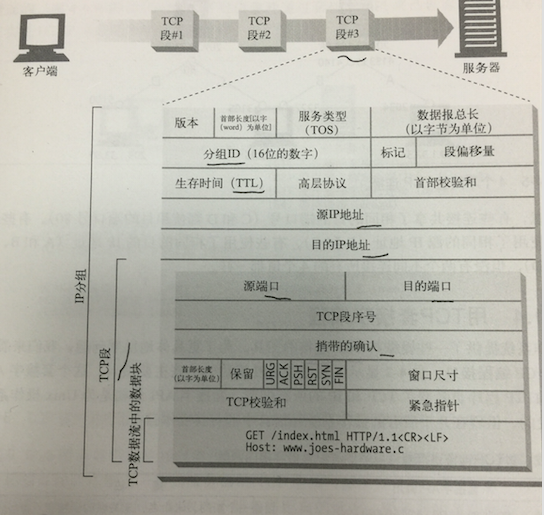
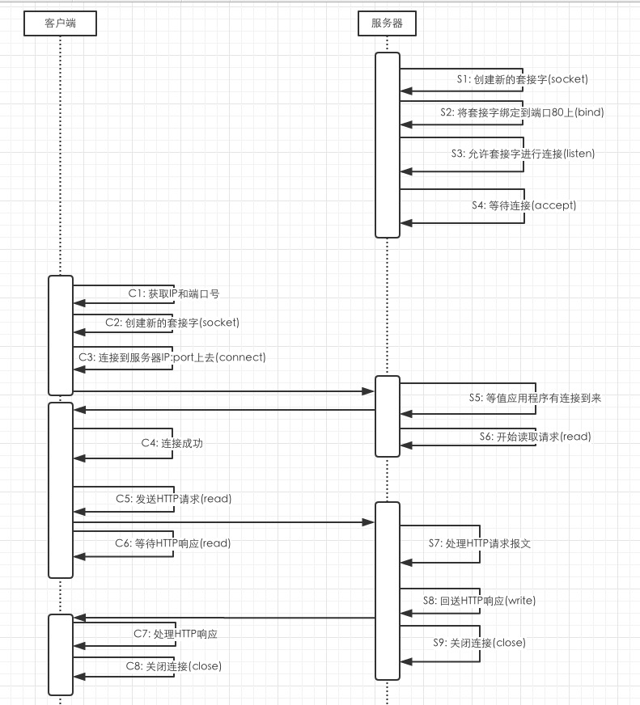
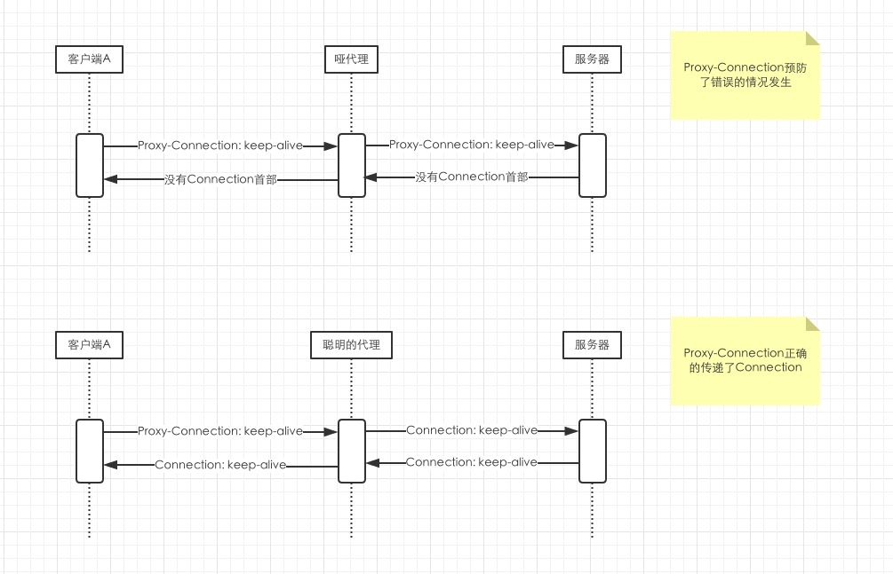
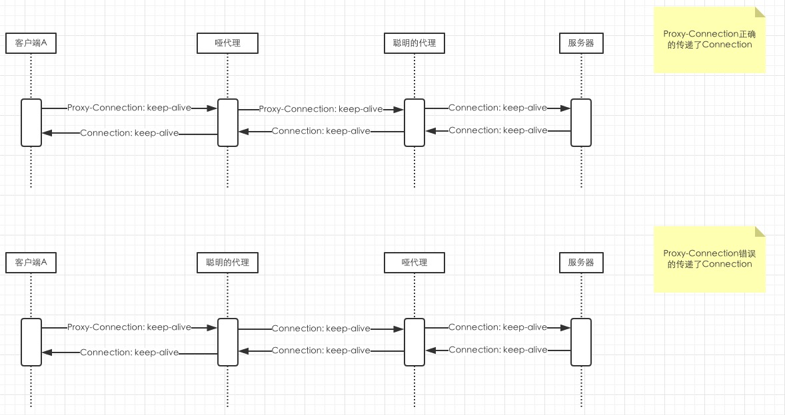

# HTTP权威指南

# 第一部分: Web的基础

# 4. 链接管理

## 4.1 TCP链接

### 4.1.1 TCP的可靠数据管道

输入 http://xxx.com:80的url请求

- 浏览器解析主机名
- 浏览器查询主机的IP地址(DNS) 202.43.378.3
- 浏览器获得端口号 80
- 浏览器发送 202.43.378.3端口80的连接
- 浏览器向服务器发送一条HTTP GET报文
- 浏览器从服务器读取HTTP 响应报文
- 浏览器关闭链接

### 4.1.2 TCP流是分段的、由IP分组传送

HTTP和HTTPS网络协议栈

- HTTP: 应用层
- TCP: 传输层
- IP: 网络层
- 网络接口: 数据链路层

HTTPS的

- HTTP: 应用层
- TSL or SSL: 安全层
- TCP: 传输层
- IP: 网络层
- 网络接口: 数据链路层

HTTP要发送一条报文时 会以流的形式将报文数据的内容通过一条打开的TCP连接按序传输

TCP收到数据流之后 会将数据流砍成被称作段的小数据块 并将段封装在IP分组里 通过因特网进行传输

每个TCP段都是由IP分组承载 从一个IP地址发送到另一个IP地址的

每个IP分组中都包括

- 一个IP分组的首部(一般20字节): 源和目的IP地址、长度和一些标记
- 一个TCP端的首部(一般20字节): TCP端的首部包含了TCP端口号、TCP控制标记以及用于数据排序和完整性检查的一些数字值
- 一个TCP数据块(0/更多字节)



### 4.1.4 用TCP套接字编程

|套接字API调用|描述|
|--|--|
|s = socket(<parameters>)| 创建一个新的、未命名、未关联的套接字|
|bind(s, <local IP:port>)| 向套接字赋一个本地端口号和接口|
|connect(s, <remote IP:port>)|创建一条连接本地套接字与远程主机及端口的连接|
|listenr(s, ...)| 标识一个本地套接字，使其可以合法接受连接|
|s2 = accept(s)| 等待某人建立一条到本地端口的连接|
|n = read(s, buffer, n)|尝试从套接字向缓冲区读取n个字节|
|n = write(s, buffer, n)| 尝试从缓冲区中向套接字写入n个字节|
|close(s)| 只关闭TCP连接的输入/输出端|
|shutdown(s, <side>)|只关闭TCP连接的输入或输出端|
|getsockopt(s, ...)| 读取某个内部套接字配置选项的值|
|setsockopt(s, ...)| 修改某个内部套接字配置选项的值|



## 4.2 对TCP性能的考虑

### 4.2.1 HTTP事物的时延

- DNS解析时间
- 建立TCP的时间
- 等待服务器处理请求报文 服务器处理请求报文
- web服务器会送HTTP响应

### 4.2.2 性能聚焦区域

最常见的TCP相关时延

- TCP连接建立握手
- TCP慢启动阻塞控制
- 数据聚集的Nagle算法
- 用于捎带确认的TCP延迟确认算法
- TIME_WAIT时延和端口耗尽

### 4.2.3 TCP连接的握手时延

小的HTTP事物可能会在TCP建立上花费50%

### 4.2.4 延迟确认

TCP实现了自己的确认机制来确保数据的成功传输

每个TCP都有一个序列号和数据完整性的校验和, 每个段的接受者收到完好的段时, 都会向发送者会送小的确认分组

如果发送者没有在指定的窗口时间内收到确认信息, 发送者就任务分组已被破坏和损毁, 并重发数据

由于确认报文很小 所以TCP允许在发往相同方向的输出数据分组中对对其"捎带"

为了增加确认报文找到同向传输数据分组的可能性, 很多TCP栈都实现一个延迟算法

延迟算法会在一个特定的窗口时间(通过100~200ms) 内将输出确认存放在缓存区 

以寻找能够捎带它的输出数据分组

但是 HTTP具有双峰特征的 请求-应答 行为降低了捎带信息的可能 

当希望有相反反向回传的分组的时候 偏偏没那么多 通常延迟确认算法会引入相当大的延迟

但操作系统可以调整或禁止延迟确认算法

### 4.2.5 TCP慢启动

TCP连接会随着时间进行调整, 起初会限制连接的最大速度

如果数据成功传输 会随着时间 提高传输速度

这陈威TCP慢启动

用于防止因特网的突然过载和拥塞

TCP慢启动限制了一个TCP端点任意时刻可以传输的分组数

简单来说 每成功接受一个分组 发送端就有了发送另外两个端的权限

这个方式称为 打开拥塞窗口

因为这样的拥塞, 旧连接会比新连接块一些

这也是HTTP持久连接的优势之一

### 4.2.6 Nagle算法和TCP_NODELAY

每个TCP段至少装载了40个字节的标记和首部

Nagle算法 试图在发送一个分组之前 将大量TCP数据绑定在一起

Nagle算法鼓励发送全尺寸(LAN最大分组大约1500字节 因特网是几百字节)的段

只有当所有其他分组都被确认之后 Nagle算法才允许发送非全尺寸的分组

如果其他分组仍然在传输过程中 就将那部分数据线存起来

只有当挂起分组被确认 或者缓存够了一个全尺寸的发送数据时 才能发缓存数据

会引起性能问题

例如Nagle和延迟确认的交互存在问题

例如接受方启动了延迟算法延迟了100~200ms 那么发送方最少要等这段时间以后 才可以继续发送报文

HTTP可以设置TCP_NODELAY禁止nagle算法 但要确认会向TCP写入大块的数据 这样才不会生成一堆小分组

### 4.2.7 TIME_WAIT累积与端口耗尽

先引入一个概念 MSL(Maximum Segment Lifetime) 就是一个TCP包最大的存活时间

一个端在TCP断开连接后 为了防止延迟的无效消息被误认为是合法的

所以要在内存维护一个控制块 用来记录最近关闭连接的IP地址和端口号 然后进入TIME_WAIT状态

维持的时间为2MSL

一个TCP连接由源IP 源端口 目标IP 目标端口组成

在一台源服务器和一台目标服务器来说 能变的只有源端口

最常见的是 代码服务器访问 数据库服务器的端口, 代码服务器没发起一次连接

就要占用本机的一个源端口 而源端口例如是6W个, 并且2MSL内连接无法复用

那么服务器连接频率 超过60000 / 120 = 500次/S

就会出现TIME_WAIT端口耗尽问题

有些操作系统的速度就会严重减缓

> 为什么要设置TIME_WAIT状态

想象这个场景

```bash
- A和B建立了一个TCP连接，A向B发送消息包1 2 3，消息包3传给B的时候延迟了，A又重传了消息包3，A和B完成通信断开连接，双方都很happy。

- A和B又建立一个TCP连接，用了相同的local IP local PORT remote IP remote PORT，A向B发送消息包1 2，B收到1 2之后，上一个连接延迟的消息包3来了，B无法区分这个消息包是上一个TCP连接的，SEQ=3刚好排在2后面。就会认为消息3是合法的 但实际上无效的延迟消息
```

这种情况需要两个条件

1. 消息包的 客户端IP、端口 服务器IP、端口 和某个旧TCP连接一致
2. SEQ number也刚好合法, 如果一个已经接受过的seq number 会被认为是一个重传的包被丢弃

所以要设置2MSL 保证延迟的消息 消失掉


> 如何查看本机有多少个源端口

linux的情况下

```bash
>  sysctl -a|grep net.ipv4.ip_local_port_range
net.ipv4.ip_local_port_range = 32768    61000
```

则是只有28232个源端口可用

> 如何查看本机设置的MSL

```bash
> sysctl -a|grep net.ipv4.tcp_fin_timeout
net.ipv4.tcp_fin_timeout = 60
```
本机设置的MSL为60S

> 如何规避TIME_WAIT问题

- 增加客户端负载生成机器的数量
- 使用长连接
- 打开tcp_tw_resue

打开tcp_tw_resue

的前提是需要客户端和服务器都打开tcp_timestamps 这样就能规避延迟消息被误认为合法的问题

但是tcp_timestamps的单位是S 所以 TIME_WAIT端口也要下一秒才能用 所以请求QPS不能超过可用端口数

关于TIME_WAIT的详解: https://blog.csdn.net/u010585120/article/details/80826999

## 4.3 HTTP连接的处理

### 4.3.1 常被误解的Connection首部

Connection可选的值

- HTTP首部字段名, 列出了只与此连接有关的首部(用逗号分隔, 这些标签不会传播到其他连接)
- 任意标签值, 用于描述此连接的非标准选项
- close 表示操作完成之后需关闭这条持久连接

### 4.3.2 串行事务处理时延

每个请求 都串行的 建立TCP连接 获取内容 断开TCP连接

那么会非常的慢

解决方案

- 并行连接: 建立多个TCP连接
- 持久连接: 重用TCP连接 以消除连接及关闭时延
- 管道化连接: 通过共享TCP连接发起并行的http请求
- 复用连接: 交替传送请求和响应报文(实验阶段)

## 4.4 并行连接

### 4.4.1 并行连接可能会提高页面的加载速度

并行连接时候 因为并行的连接请求和连接的时延 都是并行的

所以理论上是会提高速度的

### 4.4.2 并行连接不一定更快

假设用户网络很慢, 同时并行4个请求

各个请求都会去竞争网速, 所以大家都是按比例加载, 所以性能不会有什么提升

浏览器一般同域名也会限制并发6个资源(chrome)

这是为什么呢 假如一个页面 打开后会有100个请求

那么100个用户同时打开 那么服务器就要瞬间处理1W个请求

这是很容易引起服务器性能下降的, 从而更加影响加载速度

### 4.4.3 并行连接可能让人'感觉'更快一点

那网页来说 并行连接 可能有css html img等资源

所以用户可能看到的东西更多, 会让人感觉更快一些

## 4.5 持久链接

持久连接是 指在HTTP设备在事务处理结束后 将TCP连接保持在打开的状态 以便未来的HTTP请求重用现存的连接

直到客户端/服务器决定将其关闭

### 4.5.5 Keep-Alive连接的限制和规矩

- HTTP1.0中 客户端必须发送一个Connection: Keep-alive请求首部来激活keep-alive连接
- 客户端探明响应中有无Connection: Keep-alive响应首部, 就可以知道服务器发出响应之后是否会关闭连接了
- 只有在无需检查到连接的关闭即可确定报文实体主体部分长度的情况下, 才能将连接保持在打开状态--也就是响应报文必须有Content-length或者用分块传输编码的方式进行编码, 在一条keey-alive通道中回送错误的content-length是很糟糕的事情, 这样另一端无法准确判断一个报文的结束和另外一条报文的开始
- 代理和网关必须执行connection首部规则, 即必须在报文转发出去或将其告诉缓存之前, 删除connection首部中命名的所有首部字段以及connection首部自身
- 应该忽略http1.0的connection首部字段, 因为无法确认他们是否在比较老的代理或服务器误转发的

### 4.5.7 插入Proxy-Connection

客户端A->老旧服务器B->新服务器C

客户端A传了Connection 给老旧服务器B 老旧服务器不认识这个字段 

所以会透传给新服务器C 新服务器以为老旧服务器B想跟它长连接

所以新服务器会发起长连接 并且响应头会传给老旧服务器B为Coneection: Keep-Alive

而老旧服务器B 因为不认识Connection 也会透传Coneection 给客户端A

最终就是客户端A和新服务器C 都以为跟B建立的是长连接

而B其实建立的都是短连接

这时 带来的问题有两个

- 老旧服务器B还在乖乖的等 新服务器C跟它关闭连接
- 而此时客户端A接受到了Keep-alive 会复用之前的连接发送剩下的请求, 但老旧服务器不认为这个连接上还会有其他请求, 请求被忽略

这就是Connection带来的问题 

而Proxy-Connection什么时候会发起呢

以chrome为例 用设置-高级-设置代理服务器 之后 就会每个请求都带Proxy-Connection

因为这是当年Netspace浏览器和代理实现者定义的一个头部, 而出的一个非标准的头部

同理 我们启动了finndle 也会每个请求都带Proxy-Connection

proxy-connection 起作用仅限于 

- 只有客户端->代理->服务器的这么一层代理关系
- 或者 多层代理 聪明的代理右边不能有老旧代理

具体看图

一层代理的情况下



多层代理的情况



参考链接: https://imququ.com/post/the-proxy-connection-header-in-http-request.html

### 4.6 管道化链接

HTTP1.1允许在持久连接上可选的使用请求管道

这是在keep-alive的基础上进一步性能优化

在响应到达之前, 可以将多条请求放入队列

当一个请求通过网络传输到地区的另一端的过程中

第二个请求和第三个请求也可以开始发送了

这样可以降低网络的环回时间, 提高性能

但管道化连接由几条限制

- 如何HTTP客户端无法确认连接是持久的, 就不应该使用管道
- 必须按照与请求的相同顺序回送HTTP响应, HTTP报文中没有序列化标签, 因此如果收到的响应失序了, 就没办法将其与请求匹配起来了
- HTTP客户端必须做好连接会在任意时刻关闭的准备, 还要准备重发所有未完成的管道化请求
- HTTP客户端不应该用管道化发送会产生副作用的请求(非幂等)

## 4.7 关闭连接的奥秘

### 4.7.1 任意解除连接

所有的HTTP客户端、代理和服务器都可以在任意时刻关闭一条TCP传输连接

通常会在一条报文结束时关闭连接

但是出错的时候, 可能在首部行的中间或者其他奇怪的地方关闭连接

特别对于管道化连接 服务器会在持久连接空闲一段时间之后

服务器就会关闭连接

但在空闲的时候, 服务器不知道另外一头的客户端是否有数据要发送

### 4.7.2 Content-length及截尾操作

每个HTTP响应都应该有精确的Content-Length首部

### 4.7.4 正常关闭连接

TCP连接是双向的

TCP连接的每一端都有一个输入队列和一个输出队列

> 完全关闭与半关闭

应该程序可以通过套接字调用close()把TCP的连接输入和输出信道都关闭了

还可以用套接字调用shutdown()单独关闭输入/输出信道 这种叫半关闭

> TCP关闭及重置错误

简单的HTTP应用程序可以只使用完全关闭

但是当应用程序与客户端、服务器和代理对话且开始使用了管道化持久连接

用半关闭来防止对等实体收到非预期的写入错误就变得非常重要了

总之, 关闭连接的输出信道总是很安全的

连接另一端对等实体会在从其缓存区中读出所有数据之后收到一条通知

说明流结束了, 这样它就知道你将连接关闭了

关闭连接的输入信道是很危险的, 因为你不知道另一端还会不会给你发送数据

如果另一端向你已关闭的输入信道发送数据, 操作系统就会向另一端的机器会送一条TCP"连接被对端重置"的报文

大部分操作系统会将这个情况作为很严重的错误来处理, 删除对端还未读取的所有缓存数据, 这对管道化连接来说是非常糟糕的事情

例如A在一条持久连接上发送了10条管道式的请求, 

服务器B也已收到了, 在缓存区存着(程序还未将其读走)

这时B服务器将输入信道关闭了, 但是A给B服务器发送了第11条请求

那么B会给A返回一个重置信息, A操作系统就会清除A的输入缓存区

当A的程序要去读取数据的时, 已缓存的响应数据都没了, 虽然数据都到达了A的机器


# 第四部分 实体、编码和国际化

# 15. 实体和编码

## 15.6 传输编码和分块编码

内容编码和传输编码的对比

* 内容编码: 只是对报文的实体部分进行了可逆的编码.
* 传输编码: 作用在整个报文上,报文本身的结构发生变化.

### 15.6.1 可靠传输

传输报文主体可能会引发的问题

1. 未知尺寸: 假如服务器想在未知大小之前就无法开始传输,Content-length必须声明在数据前.
2. 安全性: 用传输编码将报文打乱,然后发送,但是SSL已经够安全了,所以这个不用考虑

### 15.6.2 Transfer-Encoding首部

最新的HTTP规范(2017-03-15)只定义了一种传输编码: 分块编码

请求头声明分块编码,告知服务器可以使用哪种传输编码拓展

TE: trailers, chunked(HTTP1.1强制默认)

在响应头声明分块编码,告知接收方使用了哪种传输编码

Transfer-Enconding: chunked

### 15.6.3 分块编码

分块传输响应DEMO

```bash
//HTTP响应
HTTP/1.1 200 OK<CR><LF>
Content-type: text/plain<CR><LF>
Transfer-encoding: chunked<CR><LF>
Trailer: Content-MD5<CR><LF>
<CR><LF>

//第一块
5<CR><LF>
01234<CR><LF>

//第二块
2<CR><LF>
01<CR><LF>

//最后一块
0<CR><LF>

//拖挂
Content-MD5: ****1112341***
```

> 1. 分块与持久连接

* 非持久连接: 本身就不需要知道长度,等着服务器关闭主体链接即可
* 持久连接: 静态内容,通过content-length获取长度,而动态内容,发送前无法知道主体的长度

分块编码规则

1. 每个分块包括两行,一行十六进制的长度值,第二行为数据
2. 两行都需要\r\n结尾
3. 最后一块的长度值必须为0,对应的分块数据没有内容

当你上传给服务器想使用分块传输时,因为服务器不会发送TE请求

所以要做好被服务器拒绝分块传输的准备(411 Length Required, 表名需要Content-length长度)

> 2. 分块报文的拖挂

拖挂用于在报文开始时无法确认的首部

除了Transfer-Encoding,Trailer以及Content-length首部外

其他HTTP首部都可以作为拖挂发送

## 15.8 验证码和新鲜度

### 15.8.1 新鲜度

服务器可以用这两个首部之一来提供这种信息

1. Expires(过期)
2. Cache-Control(缓存控制)

### 15.8.2 有条件的请求与验证码

请求类型             验证码          描述

If-Modified-Since   Last-Modified 如果前一条响应的Last-Modified首部中说明时间之后,资源的版本发生变化,就发送其副本

If-Unmodified-Since Last-Modified 仅在前一条响应的Last-Modified首部中说明的时间之后,资源的版本没有变化,才发送其副本

If-Match             Etag         如果实体的标记前一次响应收不中的Etag相同,就发送资源的副本

If-None-Match        Etag         如果实体的标记与前一次响应收不中的Etag不同,就发送该资源的副本

HTTP校验分为弱检验码(Last-Modified)和强验证码(Etag)

## 15.9 范围请求


