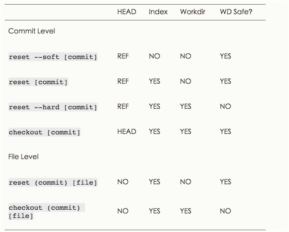

>感谢相关翻译组,此文主要参考<http://git-scm.com/book/zh/v2/%E8%B5%B7%E6%AD%A5-Git-%E5%9F%BA%E7%A1%80>

# 基础

##1 Git的优势

1. `SVN`和`Git`,因为`SVN`要是主机挂了.所有记录都GG了.而`Git`是分布式的.而且`Git`平台比较多,`GitLab`,`coding.net`,`GitHub`等等

2. `Git`可以现在本地执行,可以在本地进行`commit`,而`SVN`每次`commit`都必须是提交到主机.(虽然笔者推荐多push,但是可以本地`commit`有时也是不错的,主要是保证本地能有备份)
3. `Git`能保证数据完整性,Git中所有数据在存储前都计算校验和,然后以校验来引用,所以你在传送过程中丢失文件,Git都知道(笔者试过一个push断了4次,但是最后还是每次增量的提交了上去.)

##2. Git和SVN存储方式的不同

SVN :


Git :


注意`Git`的存储图中,外面有间隔线的表明数据没有变化,存的只是索引.

SVN是差异比较,每个版本的文件依赖于上一个版本.

Git的每个版本的文件是独立存在的,是直接记录快照.


##3. Git的三个工作区域和三种状态


三个工作区域 :

1. 工作目录 : 我们从Git仓库提取出来的文件,正在本地修改的目录
2. 暂存区域 : 是一个文件,保存下次将要提交的文件信息列表
3. Git仓库  : 保存项目元数据和对象数据库的地方


三种状态:

1. 已提交 : 如果Git仓库保存着特定版本文件,就属于已提交状态(commit)
2. 已修改 : 自上一次取出来修改了,但还没放入暂存区(add)
3. 已暂存 : 如果作了修改并放入暂存区域(add),就属于已暂存. 


其实还有二种形式可分
1. 未跟踪 : 在本地未`git add`的就是未跟踪的.
2. 已跟踪 : 上述三种状态都是已跟踪状态.

以上状态都可以通过`git status`查看 or 紧凑一点的`git status -s`


##4. 安装Git

    //ubuntu
    apt-get install git
    
其他版本系统 :<http://git-scm.com/downloads>   

##5. Git配置

1. 全局系统配置 : `/etc/gitconfig` git config --system ...
2. 用户`~/.gitconfig` or `~/.config/git/config` git config --global ...
3. 当前项目 : ./git/config

一开始设置用户名和邮箱

    $ git config --global user.name "404_K"
    $ git config --global user.email 404_K@example.com
    
更改git编译器

    git config --global core.editor 命令设定你喜欢的编辑软件
    
详情输入`git config`查看 or `git help config`

##6 获取Git仓库

1. 初始化仓库

    1. git init : 创建.git目录初始化git
    2. git add . 添加当前目录到git中.
    3. git commit -m "first commit" 放入暂存区中.
2. 克隆现有仓库

    `git clone https://github.com/mzkmzk/Read.git [重命名本地目录]
`

##7 Git 基础

##7.1 .gitignore

1. 所有空行或者以 ＃ 开头的行都会被 Git 忽略。

2. 可以使用标准的 glob 模式(简化的正则)匹配。
 
3. 匹配模式可以以（/）开头防止递归。

4. 匹配模式可以以（/）结尾指定目录。

5. 要忽略指定模式以外的文件或目录，可以在模式前加上惊叹号（!）取反.

详细可参考<https://github.com/github/gitignore>

##7.2 git diff 

1. git diff : 查看尚未暂存的文件更新了哪些部分,比较工作目录和暂存区的差异
2. git diff --staged 查看已暂存的下次将要提交的.

##7.2 git commit 

1. git commit : 进入编译器,里面包含更改信息
2. git commit -m "内容" :直接提交内容,不进入编译器
3. git commit -a : 提交所有已跟踪的文件,包括未add到缓存区的.(但不会提交未跟踪的)

##7.3 git rm

要从Git移除文件,必须git rm 掉已跟踪文件,并且commit到缓存区.并且在工作目录中删除指定文件.

会有几种情况

1. 删除之前修改过并且放到暂存区的话,则必须 `git rm -f 文件`强制删除.为了防止删除未add到缓存区的文件.
2. 当你想缓存区和仓库都删除了某目录,但工作区保留 : `git rm --cached 目录/`

git rm 后面可跟`glob`

删除log下后缀为log的文件

    git rm log/\*.log
    
为何要加\,因为不需要shell帮忙,git自行解析

git rm *~ ,所以~结尾的文件.

##7.4 git mv

git mv README.md README 

无论通过命名还是图形改名字,git都能检测出来

以上语句git会自动执行

    mv README.md README
    git rm RADME.md
    git add README

##7.5 git log

`git log`参数说明

| 选项            | 说明                             |
|-----------------|----------------------------------|
| -p              | 显示更新差异                     |
| --stat          | 显示修改统计信息                 |
| --shortstat     | 只显示--stat中最后的行数修改统计 |
| --name-only     | 显示已修改文件清单               |
| --name-status   | 显示新增,修改和删除的文件清单    |
| --abbrev-commit | 只显示SHA-1的前几个字符          |
| --relative-date | 使用较短的时间显示               |
| --graph         | 图形显示分支合并历史             |
| --pretty        | 使用自定义格式显示历史提交信息   |

git log 限制输出

| 选项        | 说明                              |
|-------------|-----------------------------------|
| -n          | 仅显示n条提交                     |
| --after     | 显示指定时间之后的提交            |
| --before    | 显示指定时间之前的提交            |
| --author    | 只显示该作者                      |
| --committer | 只显示该提交者                    |
| --grep      | 显示关键字                        |
| -S          | 只显示添加/删除了某个关键字的提交 |

##7.6 撤销操作

1. 当你先commit了一次,后面发现少add了一些文件/commit的信息写错了

        git commit -m  "first"
        git add other.js
        git commit --amend
        
2. 当已经`commit`但想撤回提交到缓冲区.
    
    `git reset HEAD 文件名`
        404-K:My_Website maizhikun$ git add .
        404-K:My_Website maizhikun$ git status
        On branch master
        Your branch is ahead of 'origin/master' by 7 commits.
          (use "git push" to publish your local commits)
        Changes to be committed:
          (use "git reset HEAD <file>..." to unstage)
        
        	modified:   REAMDME.md

        404-K:My_Website maizhikun$ git reset HEAD REAMDME.md
        Unstaged changes after reset:
        M	REAMDME.md

3. 想撤销工作区间的操作,

    `git checkout -- README.md`,注意这会把git仓库中的文件覆盖掉你本地的文件.

##7.7 git remote

1. git remote -v 可以看到当前远程仓库的名字和url
2. git remote add <自定义远程仓库名称> url : 添加分支
3. git fetch 自定义远程仓库名称 :把远程仓库名称对应的仓库拉下来
4. git remote show 自定义远程仓库名称 可以查看指定远程仓库的信息
5. git pull是抓取所有分支的更改下来
6. git remote rename 更新后的仓库名称 需要更新名称的仓库

##7.8 git tag 

标签分为两种附注标签和轻量标签

1. 附注标签 : 存储在git数据库中的一个完整对象,它们可以被校验,包含打标签者的名称,电子邮箱,日期,标注信息.
        git tag -a v0.1 -m "tag message"
2. 轻量标签 :它是一个特定提交的引用,轻量标签本质上是讲提交校验和存储到一个文件中
        git tag v0.1

查看标签信息 git show 版本号

如果后期追加标签

    git tag -a v0.2 SHA-1码

共享标签

    git push origin 标签名称
    //or 提交多个标签
    git push origin
     --tags
     
检出标签

    git checkout -b 分支名称 标签名称 

##8. Git分支

` git log --oneline --decorate`可以查看分支父节点

创建新分支

    git branch 分支名称
    
切换分支

    git checkout 分支名称
    
删除分支

    git branch -d 分支名称
    
 合并分支
 
    git merge 分支名称
    
查看当前分支和所有的分支

    git branch
    git branch -v //查看每个分支最后一次提交
    git branch --merged/--no-merged
    git branch --vv //查看设置所有跟踪的分支.
    //显示合并/未合并到当前分支的分支
    
`git pull` 和 `git fetch`    

大多数情况下,git pull = git fetch + git merge

git fetch从服务器上抓本地没有的数据,它不会修改工作目录的内容,它只会获取数据.建议多使用git fetch,何时merge应该自己使用.

删除远程分支:当远程分支的工作完成了,也就是你和其他作者已经完成了指定任务并且merge到master分支上,就可以删除远程分支

git push origin --delete 远程分支名称

##8.1 变基

变基的作用是让开发线的注释会像串行一样显示,而非merge那样并行的显示.

合并分支,一般都使用merge或rebase

merge是指:当有两个分支分别改了代码,merge是把这两个分支和她们的共同祖节点进行合并,合并成新的分支.

rebase: 现在有两个并行的开发分支C3和C4,先把C4rebase到C3中,然后再到C3mergeC4,完成变基.

变基的玩法

一开始的情况


现在只想提交client到master,怎么办?.

    $ git rebase --onto master server client
    git checkout master
    $ git merge client
    
完成目标.

变基的准则:**不要对在你的仓库外有副本的分支执行变基**

因为变基相当于丢弃现有的提交然后进行不同的提交,如果你已经把这个分支提交到仓库,别人抓了下来,你再向rebase修改,其他开发者必须和你进行合并修改.

##9.服务器上的Git协议

git init --bare,可以生成一个空的仓库,初始化仓库时不会创建工作空间.

自行搭建git服务器建议gitlab<https://bitnami.com/stack/gitlab >,帮组文件<https://gitlab.com/gitlab-org/gitlab-ce/tree/master >

第三方git托管<https://git.wiki.kernel.org/index.php/GitHosting>

##9.1 生成key

`ssh-keygen`通过设定以后,就会在`~/.ssh发现公钥(.pub)和密钥了.`

一般使用

    ssh-keygen -t rsa -b 4096 -C "your_email@404mzk.com"
    
##10 Git工具

##10.1 重写历史

1. 修改最近一次commit的消息`$ git commit --amend`

##10.2 重置

    树	用途
    HEAD 上一次提交的快照，下一次提交的父结点

    Index 预期的下一次提交的快照
    
    Working Directory 沙盒

查看Index(下次准备push的)

    git ls-files -s

重置命名 reset,原理

1. 移动HEAD(若指定了 --soft，则到此停止）
2. 更新索引(--mixed),HEAD指向当前快照内容更新索引.
3. 更新工作目录(--hard)

reset和checkout的危险性




## 11. 分布式Git

### 11.2 向一个项目贡献

1. 注意空白错误(行尾空格、Tab制表符、行首空格后跟Tab制表符的行为): `git diff --check` 找出这类错误

## 12. GitHub

### 12.2 对项目作出贡献

方法一:

1. fork
2. git clone下来自己刚fork的
3. 在master新建分支
4. 修改并push
5. 在githu上提出合并请求

方法二:

1. 在源版本`git remote add upstream 仓库名`
2. git fetch upstream
3. git merge upstream/master
4. 修改 push

## 13. Git工具

### 13.2 交互式缓存

作用: 修改一组文件后,把一个提交放到若干个提交

1. git add -i 

    ```javascript
    What now> 5
           staged     unstaged path
  1:        +0/-1        +0/-1 trunk/grouplus-user/resources/assets/js/containers/InfluenceListInvitation.js
Patch update>>
*** Commands ***
  1: status	  2: update	  3: revert	  4: add untracked
  5: patch	  6: diff	  7: quit	  8: help
    ```
    
    会大概有这么些操作,如果只想改部分可以选择5,然后e,把不要提交的部分的+/-号去掉