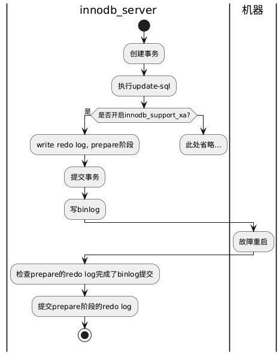
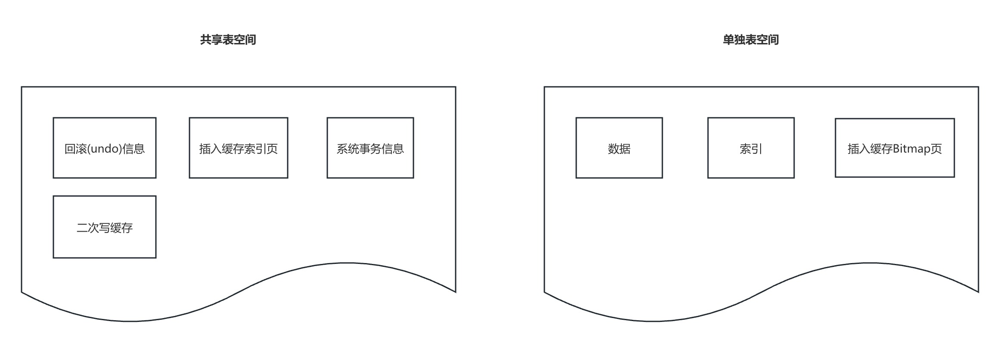
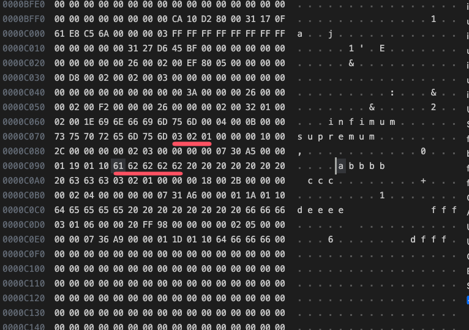
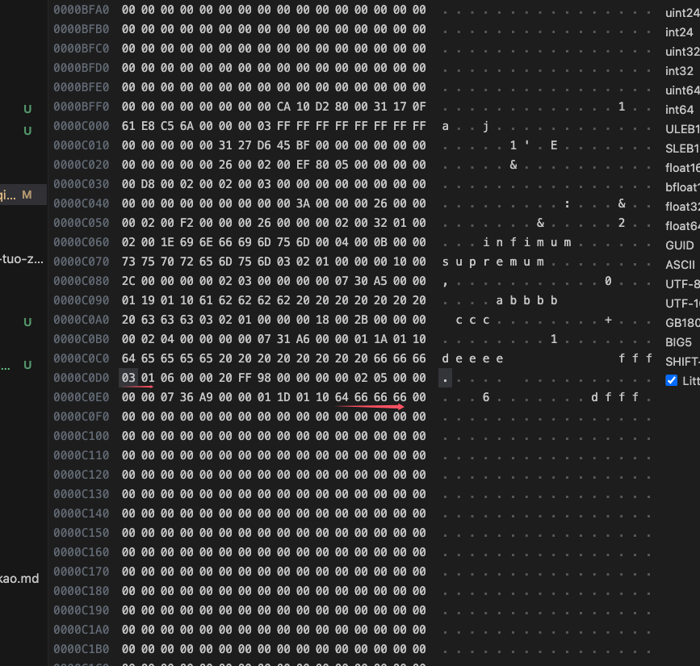
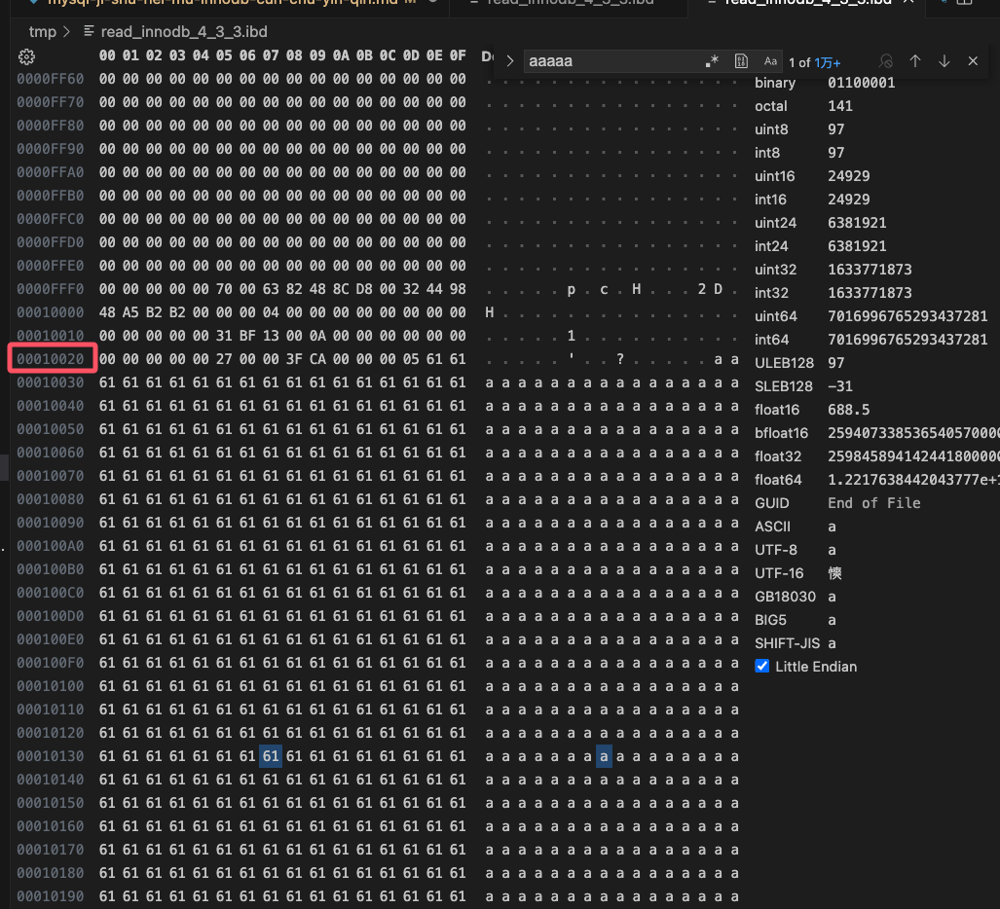
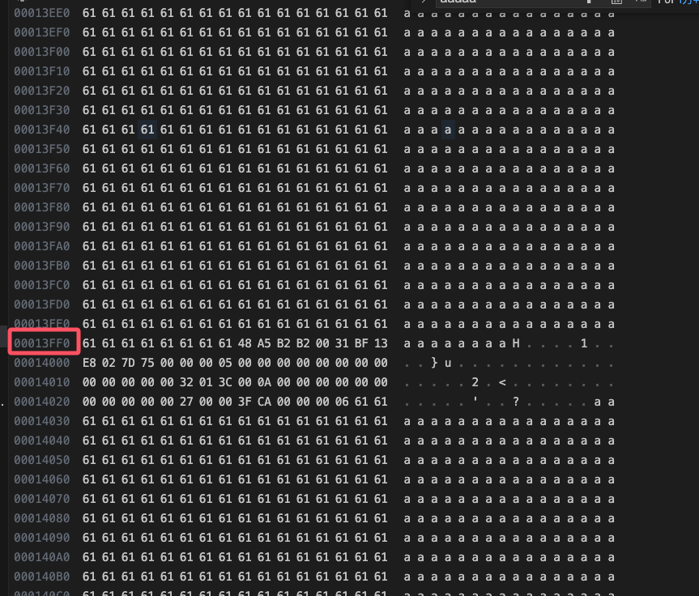

# MySQL技术内幕InnoDB存储引擎

# 总结

本书较通俗易懂的讲述了mysql的特性, 评分4星

# 1. MySQL体系结构和存储引擎

## 1.3 MySQL存储引擎

存储引擎是基于表的, 而不是数据库

# 2. InnoDB存储引擎

## 2.6 InnoDB关键特性

### 2.6.1 插入缓存

辅助索引不能是唯一的, 因为在插入缓存时, 数据库并不回去查找索引页来判断插入的记录的唯一性

如果去查找肯定又会有离散读取的情况发生, 从而导致Insert Buffer失去了意义

# 3. 文件

1. 参数文件: mysql启动的配置文件
2. 日志文件: 错误日志, 二进制日志文件, 慢查询日志文件, 查询日志文件等
3. socket文件: 用unix域嵌套字方式进行连接时需要的文件
4. pid文件: mysql实例的进程id文件
5. mysql表结构文件: 用来存放mysql表结构定义文件
6. 存储引擎文件: 存储记录和索引的文件

## 3.1 参数文件

- 启动时参数指定参数文件

查询方式:

```bash
# 根据端口查询占用的pid
[root@x aaa]# lsof -i:3308
COMMAND  PID  USER   FD   TYPE DEVICE SIZE/OFF NODE NAME
mysqld  2924 mysql   13u  IPv6  18684      0t0  TCP *:tns-server (LISTEN)

# 根据pid=2924查询启动命令
[root@aaa 2924]# cat /proc/2924/cmdline
/usr/local/mysql-5.7.17/bin/mysqld--defaults-file=/etc/my.cnf.3308
```

- 查看mysql的默认查找参数日志顺序

```bash
[root@aaa bin]# ./mysql --help | grep my.cnf
                      order of preference, my.cnf, $MYSQL_TCP_PORT,
/etc/my.cnf /etc/mysql/my.cnf /usr/local/mysql/etc/my.cnf ~/.my.cnf
```

- 无配置文件找到

无找到时, 会按mysql的默认配置启动

## 3.2 日志文件

### 3.2.1 错误日志

```bash
mysql> show variables like 'log_error';
+---------------+--------------------------------------------+
| Variable_name | Value                                      |
+---------------+--------------------------------------------+
| log_error     | /usr/local/mysql/data_3307/st01023vm45.err |
+---------------+--------------------------------------------+
1 row in set (0.00 sec)
```

### 3.2.2 慢查询日志

查询慢日志相关开关配置
```bash
# 查询是否开启慢日志记录
mysql> show variables like 'log_slow_queries';
+------------------+-------+
| Variable_name    | Value |
+------------------+-------+
| log_slow_queries | ON    |
+------------------+-------+
1 row in set (0.00 sec)

# 查询慢日志的耗时阈值, 大于该值输出慢日志
mysql> show variables like 'long_query_time';,
+-----------------+----------+
| Variable_name   | Value    |
+-----------------+----------+
| long_query_time | 1.000000 |
+-----------------+----------+

# 查询未使用索引的日志
mysql> show variables like 'log_queries_not_using_indexes';
+-------------------------------+-------+
| Variable_name                 | Value |
+-------------------------------+-------+
| log_queries_not_using_indexes | OFF   |
+-------------------------------+-------+

# 每分钟允许未使用索引的日志写入文件个最大次数
mysql> show variables like 'log_throttle_queries_not_using_indexes';
+----------------------------------------+-------+
| Variable_name                          | Value |
+----------------------------------------+-------+
| log_throttle_queries_not_using_indexes | 0     |
+----------------------------------------+-------+
```
查询慢日志路径

```bash
mysql> show variables like 'slow_query_log_file';
+---------------------+------------------+
| Variable_name       | Value            |
+---------------------+------------------+
| slow_query_log_file | slow_queries.log |
+---------------------+------------------+

mysql> show variables like 'datadir';
+---------------+-----------------------------+
| Variable_name | Value                       |
+---------------+-----------------------------+
| datadir       | /usr/local/mysql/data_3307/ |
+---------------+-----------------------------+

[root@st01023vm45 data_3307]# cat /usr/local/mysql/data_3307/slow_queries.log

# User@Host: root[root] @  [172.30.43.69]
# Query_time: 7.214444  Lock_time: 0.001474 Rows_sent: 0  Rows_examined: 728249
SET timestamp=1688711829;
UPDATE `component_entry_configs` SET `deleted_at`='2023-07-07 14:36:46.131707' WHERE key_name in ('cdtid9tqdmgdm34nng50','catbmmp0ep6np4pt61n0','c6559fqqj8qtlq7ep2h0','cdqvd8118hu96ddfnb80','ccmjau1inmkroeob6h20','cd8dbj9inmkmskps1jdg','cdq4rj118hu96ddfn6j0','cdupjkpr0p470mov751g','ce8d97ih6lsdjo3aali0','c5a2f22qj8qoh2hgu3bg','cd8obgpinmkmskps9os0','chjlhbcsqei01766houg','ca2ds7iqj8qpmbs4qda0','cac7nf2qj8qqnksl7uog','cfpir2hr0p4c18b4d7s0','cdtid9tqdmgdm34nng6g','c6fl8jaqj8qtfpahtln0','cdtf8elqdmgdm34nn2n0','ccq19ae25sus2gs6hjm0'
```

### 3.2.3 查询日志


```bash
mysql> SHOW VARIABLES LIKE 'general_log';
+---------------+-------+
| Variable_name | Value |
+---------------+-------+
| general_log   | OFF   |
+---------------+-------+
1 row in set (0.00 sec)
```

### 3.2.4 二进制日志

二进制日志记录了对mysql数据执行更改的所有操作

查看二进制文件路径

```bash
# 查询bin_log 是否开启
mysql> show variables like 'log_bin';
+---------------+-------+
| Variable_name | Value |
+---------------+-------+
| log_bin       | ON    |
+---------------+-------+
1 row in set (0.00 sec)

# 查询datadir bin_log就在这
mysql> show variables like 'datadir';
+---------------+-----------------------------+
| Variable_name | Value                       |
+---------------+-----------------------------+
| datadir       | /usr/local/mysql/data_3307/ |
+---------------+-----------------------------+

# 查看bin-log文件
mysql> SHOW BINARY LOGS;
+------------------+------------+
| Log_name         | File_size  |
+------------------+------------+
| mysql-bin.000233 | 1073745120 |
| mysql-bin.000234 | 1073742062 |
| mysql-bin.000235 |  152539169 |
+------------------+------------+

#查看binlog当前位点
mysql> show master status \G;
*************************** 1. row ***************************
            File: mysql-bin.000235
        Position: 159895850
    Binlog_Do_DB:
Binlog_Ignore_DB:
1 row in set (0.00 sec)


# 查看bin_log文件, 文件名默认为主机名, 可以通过配置参数log-bin=[name]制定
-rw-rw----  1 mysql mysql 1073745604 2024-08-20 11:13:41 mysql-bin.000231
-rw-rw----  1 mysql mysql  353864634 2024-09-13 03:28:59 mysql-bin.000232
-rw-rw----. 1 mysql mysql         38 2024-08-20 11:13:41 mysql-bin.index

# 查看binlog索引文件
[root@st01023vm45 data_3307]# cat  mysql-bin.index;
./mysql-bin.000231
./mysql-bin.000232
```

以下几个参数与binlog文件有关

|  参数   | 作用     |  查询方式 |
| ---- | ---- | ---- |
| max_binlog_size       | 单个二进制日志文件的最大值, 默认为1G | SHOW VARIABLES LIKE 'max_binlog_size'; |
| binlog_cache_size       | binlog缓存池的大小 | show variables like 'binlog_cache_size';|
| sync_binlog       | 二进制日志文件写入缓冲池的频率, 可以为0, 1, 大于1的整数 | show variables like 'sync_binlog'; |
| binlog-do-db       | /usr/local/mysql/data_3307/ |
| binlog-ignore-db       | /usr/local/mysql/data_3307/ |
| log-slave-update       | /usr/local/mysql/data_3307/ |
| binlog-format      | /usr/local/mysql/data_3307/ |

- binlog_cache_size的写入规则

默认为32K, 是每个会话创建一个事务时, mysql会自动分配一个binlog_cache_size的缓存, 所以不能设置过大.

也不能设置过小, 因为会频繁写入二进制临时文件


```bash
mysql> show variables like 'binlog_cache_size';
+-------------------+-------+
| Variable_name     | Value |
+-------------------+-------+
| binlog_cache_size | 32768 |
+-------------------+-------+

# 查看binlog_cache_use和disk_use的次数, 注意这里是次数, 不是cache空间的大小
mysql> show global status like 'binlog_cache%';
+-----------------------+--------+
| Variable_name         | Value  |
+-----------------------+--------+
| Binlog_cache_disk_use | 5741   |
| Binlog_cache_use      | 458770 |
+-----------------------+--------+
```
当Binlog_cache_disk_use出现比较多次时,就应该考虑增加binlog_cache_size

- sync_binlog

sync_binlog=1为采用同步写磁盘的方式写二进制

当is_innodb_support_xa为0时, binlog和redo log互不影响, 会出现主从数据不一致的情况



```bash
flowchart LR
  创建事务 --> 执行update-sql
  执行update-sql --> 
  is_innodb_support_xa{是否开启innodb_support_xa}

  subgraph writeLog[write log并行]
  direction LR
  redoLog[write redo log] 
  binLog[write bin log]
  end

  is_innodb_support_xa -->|否| writeLog
  
```


当is_innodb_support_xa为1时, 当写入binlog后, mysql重启会检查prepare的事务是否已提交了binlog, 提交了的话, prepare的会执行commit环节




```bash
@startuml
|innodb_server|
start

:创建事务;
:执行update-sql;
if (是否开启innodb_support_xa?) is (是) then
:write redo log, prepare阶段;
:提交事务;
:写binlog;
|机器|
:故障重启;
|innodb_server|
:检查prepare的redo log完成了binlog提交;
:提交prepare阶段的redo log;
stop;
|innodb_server|
else
:此处省略...;
detach
@enduml
```


[参考链接](https://github.com/mao888/golang-guide/blob/main/mysql/MYSQL%E7%9F%A5%E8%AF%86%E7%82%B9%E6%95%B4%E7%90%86.md#mysql%E7%9A%84binlog%E6%9C%89%E5%87%A0%E7%A7%8D%E5%BD%95%E5%85%A5%E6%A0%BC%E5%BC%8F%E5%88%86%E5%88%AB%E6%9C%89%E4%BB%80%E4%B9%88%E5%8C%BA%E5%88%AB)


- binlog-format

查询binlog格式

```bash
mysql> select @@session.binlog_format;
+-------------------------+
| @@session.binlog_format |
+-------------------------+
| ROW                     |
+-------------------------+
1 row in set (0.01 sec)
```

更改binlog格式

```bash
mysql>set global binlog_format='ROW'
```

格式有三种

1. Row
2. Statement
3. MIXED

设置了binlog_format为ROW, 则可以将innodb事务隔离级别设置为READ COMMTTED, 以获得更好的并发性

MIXED模式下, 默认情况下采取STATEMENT格式存储二进制日志, 但是有些情况会使用ROW格式

  1. 使用了uuid()、user()等不确定函数
  2. 使用了临时表

## 3.6 Innodb存储引擎文件

### 3.6.1 表空间文件

Innodb将存储的数据按表空间(tablespace)进行存放

查看innodb的文件配置

```bash
mysql>  show variables like "innodb_data_file_path";
+-----------------------+------------------------+
| Variable_name         | Value                  |
+-----------------------+------------------------+
| innodb_data_file_path | ibdata1:12M:autoextend |
+-----------------------+------------------------+
```

这个表示ibdata1大小为12M, 当用完了,autoextend表示会自动增长

也可设置为/db1/ibdata1:12M;/db2/ibdata1:12M:autoextend

表示两个文件共同承担表空间, 如果两个文件在不同磁盘里, 磁盘负载会被平均

如果设置了innodb_file_per_table, 每个表都会有单独的表空间文件

```bash
mysql> show variables like 'innodb_file_per_table';
+-----------------------+-------+
| Variable_name         | Value |
+-----------------------+-------+
| innodb_file_per_table | ON    |
+-----------------------+-------+
1 row in set (0.02 sec)
```
文件的命令是,数据库为目录名,文件名问表名.ibd, 例如我有个表是`study_mysql_002_go_mysql_canal.canal_test`

```bash
bash-4.2$ ls -llah
total 136K
drwxr-x--- 2 mysql mysql 4.0K Dec  9 14:29 .
drwxrwxr-x 1 mysql root  4.0K Dec  5 15:44 ..
-rw-r----- 1 mysql mysql 8.5K Dec  9 14:29 canal_test.frm
-rw-r----- 1 mysql mysql 112K Dec  9 14:29 canal_test.ibd
-rw-r----- 1 mysql mysql   65 Dec  5 15:44 db.opt
bash-4.2$ pwd
/var/lib/mysql/data/study_mysql_002_go_mysql_canal
```

独立的表空间只存储数据、索引、插入缓存BITMAP等信息, 其他信息还是存放在默认表空间

# 4 表

主要讲述和表在磁盘的存储结构.

## 4.1 索引组织表

innodb中, 表是根据主键顺序存放的, 如果表没有主键, 会按以下方式选择主键

1. 首先选择表中第一个有唯一索引的列(顺序为定义索引的顺序、而不是建表时列的顺序), 如果有则该列为主键
2. 如果没有, 则自动创建一个6字节的指针

## 4.2 Innodb逻辑存储结构

表空间由段、区、页组成


### 4.2.1 表空间

设置了innodb_file_per_table为on时, 每个表都会自己一个独立的表空间, 但还是会有部分数据内容存储在共享表空间, 以下为单独表空间和共享表空间存储的数据内容




可以使用py_innodb_page_info.py进行表空间的分析

下载地址: https://github.com/qingdengyue/david-mysql-tools/tree/master/py_innodb_page_type

使用方式

```bash
> python2 py_innodb_page_info.py /tmp/ibdata1
# 总页数
Total number of page: 768: 
# 插入缓存的空闲列表的页数
Insert Buffer Bitmap: 8
# 
System Page: 136
Transaction system Page: 2
# 可用页
Freshly Allocated Page: 468
# undo页
Undo Log Page: 110
File Segment inode: 13
# 数据页
B-tree Node: 23
File Space Header: 8
```

### 4.2.2 段

表空间有叶子节点段、非叶子节点段、回滚段组成

叶子节点段其实就是数据段

非叶子节点段就是索引段

### 4.2.3 区

区是由连续的页组成的, 每个区的大小为1MB, 为了保证区中页的连续性, Innodb存储引擎一次从磁盘申请4~5个区

页的大小为16KB, 一个区一共有64个(1024/16)连续的页面

```bash
# 查看页大小
mysql > SHOW VARIABLES LIKE 'innodb_page_size';
+-----------------+-------+
| Variable_name   | Value |
+-----------------+-------+
| innodb_page_size| 16384 |
+-----------------+-------+
```

```bash
# 创建mysql表
mysql > create table read_innodb_4_2_3_t1 (
  col1 int not null auto_increment,
  col2 varchar(7000),
  primary key (col1))  ENGINE=InnoDB character set utf8;
);

# 查看刚创建时私有表的大小
bash-4.2$ ls -llh
total 132K
-rw-r----- 1 mysql mysql  65 Dec 25 09:31 db.opt
-rw-r----- 1 mysql mysql 29K Dec 25 09:38 read_innodb_4_2_3_t1.frm
-rw-r----- 1 mysql mysql 96K Dec 25 09:38 read_innodb_4_2_3_t1.ibd
bash-4.2$ pwd
/var/lib/mysql/data/read_innodb

# 查看刚创建表时的页分析
➜  py_innodb_page_type git:(master) ✗ python2 ./py_innodb_page_info.py -v  /tmp/read_innodb_4_2_3_t1.ibd
page offset 00000000, page type <File Space Header>
page offset 00000001, page type <Insert Buffer Bitmap>
page offset 00000002, page type <File Segment inode>
page offset 00000003, page type <B-tree Node>, page level <0000>
page offset 00000000, page type <Freshly Allocated Page>
page offset 00000000, page type <Freshly Allocated Page>
Total number of page: 6:
Freshly Allocated Page: 2
Insert Buffer Bitmap: 1
File Space Header: 1
B-tree Node: 1
File Segment inode: 1

# 插入记录
mysql > insert read_innodb_4_2_3_t1 select null, repeat('a', 7000);

# 分析页数量
➜  py_innodb_page_type git:(master) ✗ python2 ./py_innodb_page_info.py -v  /tmp/read_innodb_4_2_3_t1.ibd
page offset 00000000, page type <File Space Header>
page offset 00000001, page type <Insert Buffer Bitmap>
page offset 00000002, page type <File Segment inode>
page offset 00000003, page type <B-tree Node>, page level <0000>
page offset 00000000, page type <Freshly Allocated Page>
page offset 00000000, page type <Freshly Allocated Page>
Total number of page: 6:
Freshly Allocated Page: 2
Insert Buffer Bitmap: 1
File Space Header: 1
B-tree Node: 1
File Segment inode: 1

# 这里其实会比较奇怪, 因为我的col2是utf8, 所有应该占据了7000 * 3 / 1024 = 20kb 大小, 超出我页的限制大小16K, 但是b+树还是只有一个页节点

# 继续插入记录
mysql > insert read_innodb_4_2_3_t1 select null, repeat('a', 7000);

➜  py_innodb_page_type git:(master) ✗ python2 ./py_innodb_page_info.py -v  /tmp/read_innodb_4_2_3_t1.ibd
page offset 00000000, page type <File Space Header>
page offset 00000001, page type <Insert Buffer Bitmap>
page offset 00000002, page type <File Segment inode>
page offset 00000003, page type <B-tree Node>, page level <0000>
page offset 00000000, page type <Freshly Allocated Page>
page offset 00000000, page type <Freshly Allocated Page>
Total number of page: 6:
Freshly Allocated Page: 2
Insert Buffer Bitmap: 1
File Space Header: 1
B-tree Node: 1
File Segment inode: 1

# 继续插入记录
mysql> insert read_innodb_4_2_3_t1 select null, repeat('a', 7000);

➜  py_innodb_page_type git:(master) ✗ python2 ./py_innodb_page_info.py -v  /tmp/read_innodb_4_2_3_t1.ibd
page offset 00000000, page type <File Space Header>
page offset 00000001, page type <Insert Buffer Bitmap>
page offset 00000002, page type <File Segment inode>
page offset 00000003, page type <B-tree Node>, page level <0001>
page offset 00000004, page type <B-tree Node>, page level <0000>
page offset 00000005, page type <B-tree Node>, page level <0000>
Total number of page: 6:
Insert Buffer Bitmap: 1
File Space Header: 1
B-tree Node: 3
File Segment inode: 1
```
插入了3条记录后, 开始分裂成3个节点, 其中 00000003还是非叶子节点, 因为page level 为1(0则为叶子节点)

批量插入60条一样的记录

[批量创建数据sql](./create_data.sql)

```bash
#插入后, 文件从96K大小上升为592K
➜  py_innodb_page_type git:(master) ✗ ls -lhla /tmp/read_innodb_4_2_3_t1.ibd
-rw-r-----  1 maizhikun  wheel   592K 12 30 09:41 /tmp/read_innodb_4_2_3_t1.ibd

# 页分析
 python2 ./py_innodb_page_info.py -v  /tmp/read_innodb_4_2_3_t1.ibd
page offset 00000000, page type <File Space Header>
page offset 00000001, page type <Insert Buffer Bitmap>
page offset 00000002, page type <File Segment inode>
page offset 00000003, page type <B-tree Node>, page level <0001>
page offset 00000004, page type <B-tree Node>, page level <0000>
page offset 00000005, page type <B-tree Node>, page level <0000>
page offset 00000006, page type <B-tree Node>, page level <0000>
page offset 00000007, page type <B-tree Node>, page level <0000>
page offset 00000008, page type <B-tree Node>, page level <0000>
page offset 00000009, page type <B-tree Node>, page level <0000>
page offset 0000000a, page type <B-tree Node>, page level <0000>
page offset 0000000b, page type <B-tree Node>, page level <0000>
page offset 0000000c, page type <B-tree Node>, page level <0000>
page offset 0000000d, page type <B-tree Node>, page level <0000>
page offset 0000000e, page type <B-tree Node>, page level <0000>
page offset 0000000f, page type <B-tree Node>, page level <0000>
page offset 00000010, page type <B-tree Node>, page level <0000>
page offset 00000011, page type <B-tree Node>, page level <0000>
page offset 00000012, page type <B-tree Node>, page level <0000>
page offset 00000013, page type <B-tree Node>, page level <0000>
page offset 00000014, page type <B-tree Node>, page level <0000>
page offset 00000015, page type <B-tree Node>, page level <0000>
page offset 00000016, page type <B-tree Node>, page level <0000>
page offset 00000017, page type <B-tree Node>, page level <0000>
page offset 00000018, page type <B-tree Node>, page level <0000>
page offset 00000019, page type <B-tree Node>, page level <0000>
page offset 0000001a, page type <B-tree Node>, page level <0000>
page offset 0000001b, page type <B-tree Node>, page level <0000>
page offset 0000001c, page type <B-tree Node>, page level <0000>
page offset 0000001d, page type <B-tree Node>, page level <0000>
page offset 0000001e, page type <B-tree Node>, page level <0000>
page offset 0000001f, page type <B-tree Node>, page level <0000>
page offset 00000020, page type <B-tree Node>, page level <0000>
page offset 00000021, page type <B-tree Node>, page level <0000>
page offset 00000022, page type <B-tree Node>, page level <0000>
page offset 00000023, page type <B-tree Node>, page level <0000>
page offset 00000000, page type <Freshly Allocated Page>
Total number of page: 37:
Freshly Allocated Page: 1
Insert Buffer Bitmap: 1
File Space Header: 1
B-tree Node: 33
File Segment inode: 1
```

再增加一条数据

```bash

mysql> insert read_innodb_4_2_3_t1 select null, repeat('a', 7000);
Query OK, 1 row affected (0.02 sec)
Records: 1  Duplicates: 0  Warnings: 0

# 查看ibd文件大小
bash-4.2$ ll -ah
total 2.1M
drwxr-x--- 2 mysql mysql 4.0K Dec 25 09:38 .
drwxrwxr-x 1 mysql root  4.0K Dec 25 09:31 ..
-rw-r----- 1 mysql mysql   65 Dec 25 09:31 db.opt
-rw-r----- 1 mysql mysql  29K Dec 25 09:38 read_innodb_4_2_3_t1.frm
-rw-r----- 1 mysql mysql 2.0M Dec 30 09:57 read_innodb_4_2_3_t1.ibd
bash-4.2$

# 页分析
➜  py_innodb_page_type git:(master) ✗ python2 ./py_innodb_page_info.py -v  /tmp/read_innodb_4_2_3_t12.ibd
page offset 00000000, page type <File Space Header>
page offset 00000001, page type <Insert Buffer Bitmap>
page offset 00000002, page type <File Segment inode>
page offset 00000003, page type <B-tree Node>, page level <0001>
page offset 00000004, page type <B-tree Node>, page level <0000>
page offset 00000005, page type <B-tree Node>, page level <0000>
page offset 00000006, page type <B-tree Node>, page level <0000>
page offset 00000007, page type <B-tree Node>, page level <0000>
page offset 00000008, page type <B-tree Node>, page level <0000>
page offset 00000009, page type <B-tree Node>, page level <0000>
page offset 0000000a, page type <B-tree Node>, page level <0000>
page offset 0000000b, page type <B-tree Node>, page level <0000>
page offset 0000000c, page type <B-tree Node>, page level <0000>
page offset 0000000d, page type <B-tree Node>, page level <0000>
page offset 0000000e, page type <B-tree Node>, page level <0000>
page offset 0000000f, page type <B-tree Node>, page level <0000>
page offset 00000010, page type <B-tree Node>, page level <0000>
page offset 00000011, page type <B-tree Node>, page level <0000>
page offset 00000012, page type <B-tree Node>, page level <0000>
page offset 00000013, page type <B-tree Node>, page level <0000>
page offset 00000014, page type <B-tree Node>, page level <0000>
page offset 00000015, page type <B-tree Node>, page level <0000>
page offset 00000016, page type <B-tree Node>, page level <0000>
page offset 00000017, page type <B-tree Node>, page level <0000>
page offset 00000018, page type <B-tree Node>, page level <0000>
page offset 00000019, page type <B-tree Node>, page level <0000>
page offset 0000001a, page type <B-tree Node>, page level <0000>
page offset 0000001b, page type <B-tree Node>, page level <0000>
page offset 0000001c, page type <B-tree Node>, page level <0000>
page offset 0000001d, page type <B-tree Node>, page level <0000>
page offset 0000001e, page type <B-tree Node>, page level <0000>
page offset 0000001f, page type <B-tree Node>, page level <0000>
page offset 00000020, page type <B-tree Node>, page level <0000>
page offset 00000021, page type <B-tree Node>, page level <0000>
page offset 00000022, page type <B-tree Node>, page level <0000>
page offset 00000023, page type <B-tree Node>, page level <0000>
page offset 00000000, page type <Freshly Allocated Page>
page offset 00000000, page type <Freshly Allocated Page>
page offset 00000000, page type <Freshly Allocated Page>
page offset 00000000, page type <Freshly Allocated Page>
page offset 00000000, page type <Freshly Allocated Page>
page offset 00000000, page type <Freshly Allocated Page>
page offset 00000000, page type <Freshly Allocated Page>
page offset 00000000, page type <Freshly Allocated Page>
page offset 00000000, page type <Freshly Allocated Page>
page offset 00000000, page type <Freshly Allocated Page>
page offset 00000000, page type <Freshly Allocated Page>
page offset 00000000, page type <Freshly Allocated Page>
page offset 00000000, page type <Freshly Allocated Page>
page offset 00000000, page type <Freshly Allocated Page>
page offset 00000000, page type <Freshly Allocated Page>
page offset 00000000, page type <Freshly Allocated Page>
page offset 00000000, page type <Freshly Allocated Page>
page offset 00000000, page type <Freshly Allocated Page>
page offset 00000000, page type <Freshly Allocated Page>
page offset 00000000, page type <Freshly Allocated Page>
page offset 00000000, page type <Freshly Allocated Page>
page offset 00000000, page type <Freshly Allocated Page>
page offset 00000000, page type <Freshly Allocated Page>
page offset 00000000, page type <Freshly Allocated Page>
page offset 00000000, page type <Freshly Allocated Page>
page offset 00000000, page type <Freshly Allocated Page>
page offset 00000000, page type <Freshly Allocated Page>
page offset 00000000, page type <Freshly Allocated Page>
page offset 00000040, page type <B-tree Node>, page level <0000>
page offset 00000000, page type <Freshly Allocated Page>
page offset 00000000, page type <Freshly Allocated Page>
page offset 00000000, page type <Freshly Allocated Page>
page offset 00000000, page type <Freshly Allocated Page>
page offset 00000000, page type <Freshly Allocated Page>
page offset 00000000, page type <Freshly Allocated Page>
page offset 00000000, page type <Freshly Allocated Page>
page offset 00000000, page type <Freshly Allocated Page>
page offset 00000000, page type <Freshly Allocated Page>
page offset 00000000, page type <Freshly Allocated Page>
page offset 00000000, page type <Freshly Allocated Page>
page offset 00000000, page type <Freshly Allocated Page>
page offset 00000000, page type <Freshly Allocated Page>
page offset 00000000, page type <Freshly Allocated Page>
page offset 00000000, page type <Freshly Allocated Page>
page offset 00000000, page type <Freshly Allocated Page>
page offset 00000000, page type <Freshly Allocated Page>
page offset 00000000, page type <Freshly Allocated Page>
page offset 00000000, page type <Freshly Allocated Page>
page offset 00000000, page type <Freshly Allocated Page>
page offset 00000000, page type <Freshly Allocated Page>
page offset 00000000, page type <Freshly Allocated Page>
page offset 00000000, page type <Freshly Allocated Page>
page offset 00000000, page type <Freshly Allocated Page>
page offset 00000000, page type <Freshly Allocated Page>
page offset 00000000, page type <Freshly Allocated Page>
page offset 00000000, page type <Freshly Allocated Page>
page offset 00000000, page type <Freshly Allocated Page>
page offset 00000000, page type <Freshly Allocated Page>
page offset 00000000, page type <Freshly Allocated Page>
page offset 00000000, page type <Freshly Allocated Page>
page offset 00000000, page type <Freshly Allocated Page>
page offset 00000000, page type <Freshly Allocated Page>
page offset 00000000, page type <Freshly Allocated Page>
page offset 00000000, page type <Freshly Allocated Page>
page offset 00000000, page type <Freshly Allocated Page>
page offset 00000000, page type <Freshly Allocated Page>
page offset 00000000, page type <Freshly Allocated Page>
page offset 00000000, page type <Freshly Allocated Page>
page offset 00000000, page type <Freshly Allocated Page>
page offset 00000000, page type <Freshly Allocated Page>
page offset 00000000, page type <Freshly Allocated Page>
page offset 00000000, page type <Freshly Allocated Page>
page offset 00000000, page type <Freshly Allocated Page>
page offset 00000000, page type <Freshly Allocated Page>
page offset 00000000, page type <Freshly Allocated Page>
page offset 00000000, page type <Freshly Allocated Page>
page offset 00000000, page type <Freshly Allocated Page>
page offset 00000000, page type <Freshly Allocated Page>
page offset 00000000, page type <Freshly Allocated Page>
page offset 00000000, page type <Freshly Allocated Page>
page offset 00000000, page type <Freshly Allocated Page>
page offset 00000000, page type <Freshly Allocated Page>
page offset 00000000, page type <Freshly Allocated Page>
page offset 00000000, page type <Freshly Allocated Page>
page offset 00000000, page type <Freshly Allocated Page>
page offset 00000000, page type <Freshly Allocated Page>
page offset 00000000, page type <Freshly Allocated Page>
page offset 00000000, page type <Freshly Allocated Page>
page offset 00000000, page type <Freshly Allocated Page>
page offset 00000000, page type <Freshly Allocated Page>
page offset 00000000, page type <Freshly Allocated Page>
page offset 00000000, page type <Freshly Allocated Page>
Total number of page: 128:
Freshly Allocated Page: 91
Insert Buffer Bitmap: 1
File Space Header: 1
B-tree Node: 34
File Segment inode: 1
```

### 4.2.4 页

页场景的类型有

1. 数据页(B-tree Node)
2. undo页(unodo log page)
3. 系统页(system page)
4. 事务数据页(Transaction system page)
5. 插入缓冲位图页(insert buffer bitmap)
6. 插入缓冲空闲列表页(inser buffer free list)
7. 未压缩的二进制大对象页(uncompressed blob page)
8. 压缩的二进制大对象页(compressed blob page)

### 4.2.5 行

innodb是按行存储的, 页存放的记录最多允许存放 16KB / 2 -200 行的记录, 既7992行

## 4.3 Innodb 行记录格式

查看行存储格式:  `show table status like '表名'`

```bash
mysql> show table status like 'read_innodb_4_2_3_t1' \G;
*************************** 1. row ***************************
           Name: read_innodb_4_2_3_t1
         Engine: InnoDB
        Version: 10
     Row_format: Dynamic
           Rows: 31
 Avg_row_length: 17441
    Data_length: 540672
Max_data_length: 0
   Index_length: 0
      Data_free: 0
 Auto_increment: 65
    Create_time: 2024-12-25 09:38:35
    Update_time: 2024-12-30 09:57:31
     Check_time: NULL
      Collation: utf8_general_ci
       Checksum: NULL
 Create_options:
        Comment:
1 row in set (0.00 sec)

ERROR:
No query specified
```

常见的格式有


|格式|特点|
|---|---|
|Dynamic|mysql5.7后默认, 对于 TEXT, BLOB 以及很长的 VARCHAR 类型列，Dynamic 行格式会将数据的 一部分 存储在页的行记录部分，其余部分存储在溢出页中|
|Compact|所有列尽量存储在主存储页中，溢出页使用较少|
|Compressed|类似于 Dynamic，但对数据页进行压缩|

### 4.3.1 Compact 行记录格式


1. 变长字段字段: 按照字段的倒序放置, 列的长度小于等于255, 则用一个字节表示, 大于255, 则用两个字节表示. 不可以超过两字节, 因为varchar的最大长度为65535
2. Null标记位: 该行中是否有NULL值, 转为二进制, 对应的位数为1,则表示对应的行数为NULL值
3. 事务ID: 6字节
4. 回滚指针列: 7字节
5. rowid: 没有定义主键则会增加这一列, 长度为6字节
3. 记录头信息: 固定占用5字节(40bit)

Compact记录头信息

|名称|大小(bit)|描述|
|---|---|---|
|()|1|未知|
|()|1|未知|
|deleted_flag|1|该行是否已删除|
|min_rec_flag|1|为1, 如果该行时预先被定义的最小记录|
|n_owned|4|该记录拥有的记录数|
|heap_no|13|索引堆中该条记录的排序书序|
|record_type|3|记录类型, 000表示普通、001表示B+树节点指针、010表示Infimum, 011表示Supremum, 1xx表示保留
|next_record|16|页中下一条记录的相对位置|
|Total|40||

```bash
# 创建demo表
mysql > CREATE TABLE read_innodb_4_3_1_mytest(
  t1 VARCHAR(10),
  t2 VARCHAR(10),
  t3 CHAR(10),
  t4 VARCHAR(10)
) ENGINE=INNODB CHARSET=latin1 ROW_FORMAT=COMPACT;

mysql> insert into read_innodb_4_3_1_mytest values ('a', 'bb', 'bb', 'ccc');
mysql> insert into read_innodb_4_3_1_mytest values ('d', 'ee', 'ee', 'fff');
mysql> insert into read_innodb_4_3_1_mytest values ('d', NULL, NULL, 'fff');

# 输出
hexdump -C -v /tmp/read_innodb_4_3_1_2.ibd > a.log
```




```
03 02 01 // 变长字段长度列表, 逆序
00 // NULL标志位, 第一行没有NULL
00 00 10 00 2C // Record Header 固定5字节长度
00 00 00 00 02 03 // RowId Innodb自动创建 6字节
00 00 00 00 07 30 //TransactionID
A5 00 00 01 19 01 10 //Roll Pointer
61 // 列1 数据a
62 62 // 列2 数据bb
62 62 20 20 20 20 20 20 20 20 //列3 数据bb
63 63 63 列4 数据ccc
```

1. char用0x20填充直到占满10个字节
2. Record Header最后两个字节为next_recorder, 就是2C就是下一个记录的偏移量(这里没弄明白是怎么找到下条记录的)

再看看第三行记录




```
03 01 // 变长字段长度列表, 逆序
06 // NULL标志位, 转为二进制位00000110, 为1的代表第二列和第三列的数据为NULL
00 00 20 FF 98 // Record Header 固定5字节长度
00 00 00 00 02 05 // RowId Innodb自动创建 6字节
00 00 00 00 07 36 //TransactionID
A9 00 00 01 1D 01 10 //Roll Pointer
64 // 列1 数据d
66 66 66 66 列4 数据fff
```

### 4.3.3 行溢出数据

1. 最高变长65535字节是指所有varchar列的长度总和
2. 当发生行溢出时, 数据存放在类型业务 Uncompress BLOB页中


```bash
create table read_innodb_4_3_3_t (
  a varchar(65532)
) engine=innodb charset=latin1;

insert into read_innodb_4_3_3_t select repeat('a', 65532);

> python2 /Users/maizhikun/project/38200-david-mysql-tools/py_innodb_page_type/py_innodb_page_info.py /tmp/read_innodb_4_3_3.ibd
Total number of page: 9:
Insert Buffer Bitmap: 1
Uncompressed BLOB Page: 5
File Space Header: 1
B-tree Node: 1
File Segment inode: 1
```

开始


结束


从00010028到00013FF7

## 4.4 InnoDB数据页结构


# 5. 索引算法

## 5.2 数据结构和算法

二叉查找树: 左子树的键值必须比根节点的键值小, 而右子树必须比根节点的键值大

平衡二叉树: 符合二叉查找树的定义, 并且任何节点的两科子树高度最大差为1

## 5.2 B+数

基本概念

| 概念     | 说明                                 |
| -------- | ------------------------------------ |
| 最大度数 | 每个非叶子节点最多可以拥有的子节点数 |


### 5.3.1 B+树的插入操作

|Leaf Page满| Index Page满| 操作 |
|---|---|---|
|No|No| 直接插入到叶子节点 |
|Yes|No| 1. 拆分LeafPage<br>2. 将中间的节点放入到IndexPage中<br/>3. 小于中间节点的放左边<br/>4. 大于或等于中间节点的放右边 |
|Yes| Yes | 1. 拆分LeafePage<br/>2. 小于中间节点的放左边<br/>3. 大于或等于中间节点的放右边<br/>4. 拆分IndexPage<br/>5. 小于中间节点的放左边<br/>6. 大于或等于中间节点的放右边<br/>7. 将中间的节点放入到上层IndexPage中 |
|| | |

# 7. 事务

事务是数据库区别于文件系统的重要特性

Innodb的存储引擎的事务完全符合ACID特性

1. 原子性
2. 一致性
3. 隔离性
4. 持久性

