# 数据密集型应用系统设计

- 描述性能

客户端来测量响应时间很重要

# 2. 数据模型与查询语言

## 关系数据库与文档数据库现状

对于高度关联的数据, 文档模型不太适合, 关系模型可以胜任, 而图模型则是最为自然的

# 5. 数据复制

## 主从复制

### 复制滞后问题

- 读自己的写

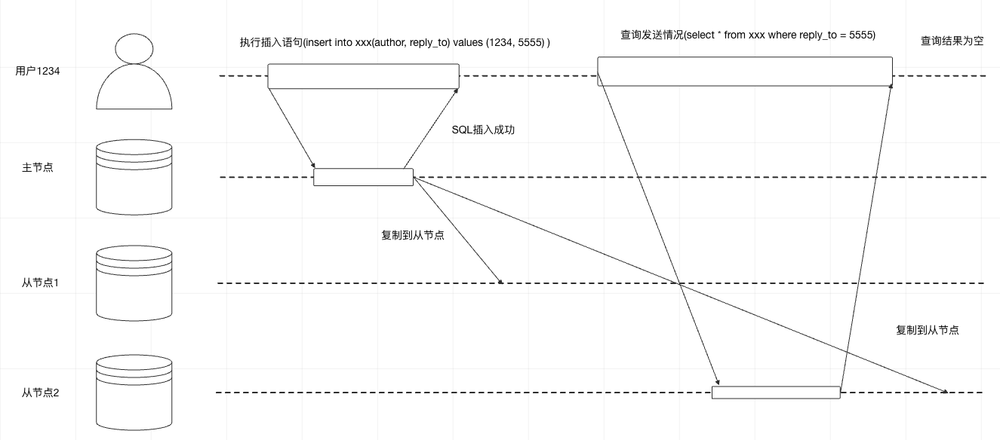

解决方案

1. 如果用户访问的内容是只有自身可修改的,那么 自己的修改和查询均读取主节点, 访问仅有其他人可修改的内容, 则读取从节点
2. 客户端记住服务端返回的更新时间戳, 读取时带上时间戳, 查询时这条记录的修改时间要大于客户端传过来的时间戳, 如果小于则查下一个db节点, 直到查到大于的为止
3. 建议读从节点的话, 只能读允许最终一致性的数据

- 单调读

同一类查询最好查询同一副本, 当这个副本失效时, 查询下一个副本

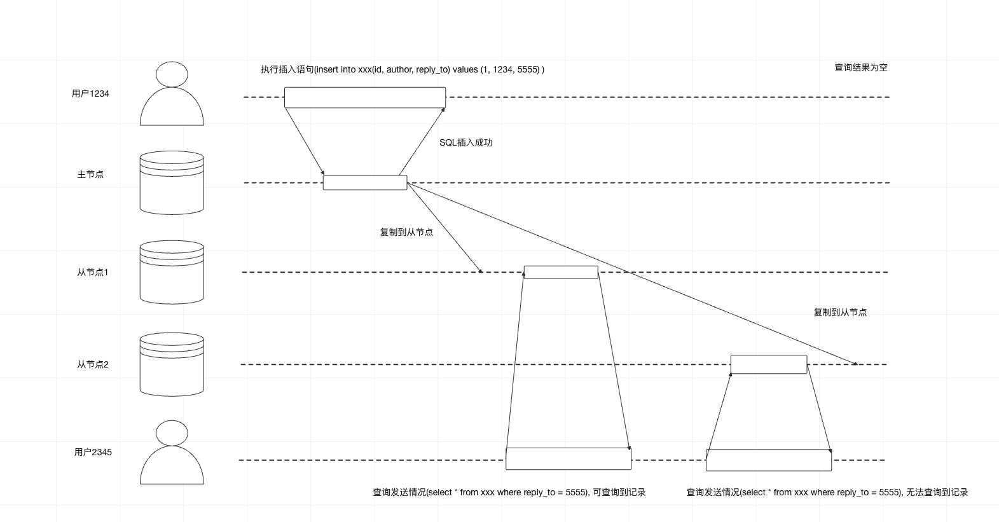

解决方案:

1. 同一用户读到的从节点要一致, 根据用户id哈希方法, 选定从节点, 如果该副本失效, 则路由到另一个副本

## 多主复制

好处

1. 提升性能, 用户可以就近访问数据
2. 容灾

处理写冲突

- 避免冲突

通过不同的userid/地理位置固定写入到一个数据中心

- 收敛于一致状态

1. 给每个写入分配一个时间戳, 大的时间戳可写入

## 无主节点复制

客户端直接向多个节点写请求

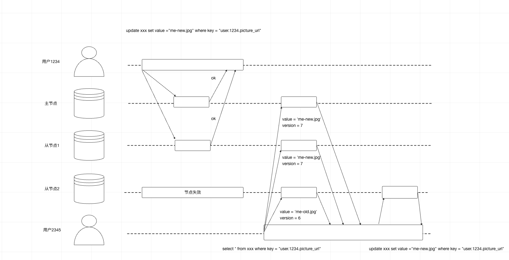

如果有n个节点, 写入需要w个节点确认, 读取需要r个节点确认, w + r > n 那么读取的节点一定包含最新值

即使在 w +r >n的情况也有可能返回旧值

- 写操作同时发生
- 写和读操作同时发生, 写操作进一部分副本上完成
- 部分副本写入成功, 部分写入失败, 且写入成功数小于w, 那么已成功的副本不会回滚
- 如果具有新值的节点失效, 但恢复数据来自某个旧值, 则总的新值副本会低于w, 打破了之前的判断条件
- 即使一切正常, 也可能出现边界情况, 参考后续可线性化与quorum

这个方案运维侧不好监控旧值情况

- 宽松的quorum与数据回传

在一个大规模集群中, 节点数远大于n, 客户端在网络中断期间,还能连接到某些数据库节点, 但这些节点不是参与仲裁的数据库节点.

如果接受写请求, 只是将他们暂时写入一些可访问的节点里, 注意这些节点并不在原本的n的节点集合中, 这种方案称为放松式仲裁.

写入和读取仍需要w和r的成功响应, 不过w可能是不在原先仲裁的节点里

当网络问题解决, 临时节点需要把接收到的写入全部发送给仲裁节点.

## 多数据中心操作

解决并发写问题

- 最后写入者获胜

- Happends-before关系和并发

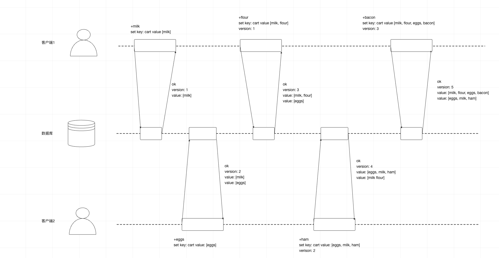

1. 服务器为每个主键维护一个版本号, 每当主键有写入时递增版本号,并将新版本号和写入值一起保存
2. 客户端读取主键时, 服务器将返回所有(未被覆盖的)当前值以及最新的版本号, 且要求写之前, 客户端必须先发送读请求
3. 客户端写主键, 写请求必须包含之前读到的版本号, 读到的值和新值合并后的集合.写请求的响应可以像读操作一样, 会返回所有当前值.
4. 当前服务器收到带有特定版本号的写入时, 覆盖该版本或更低版本的所有值(因为知道这些值 已经被合并到新传入的值集合中), 但必须保存更高版本号和所有值(因为这些值与当前的写操作属于并发)

# 6. 数据分区

## 分区与二级索引

- 基于文档分区和二级索引

场景一个销售二手汽车的网站, 每个列表都有一个唯一的文档id, 用此ID对数据库进行分区

现在用户需要搜索汽车, 可以按汽车颜色、厂商进行过滤, 所以需要在颜色、厂商上设定二级索引

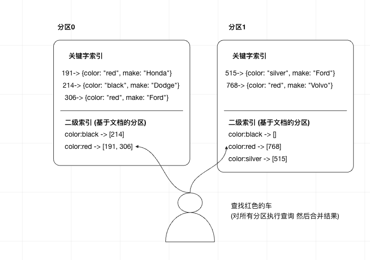

## 基于词条的二级索引分区

另外一种方法, 对所有的数据进行全局索引, 而不是每个分区维护自己的索引

但是全局索引本身也必须进行分区

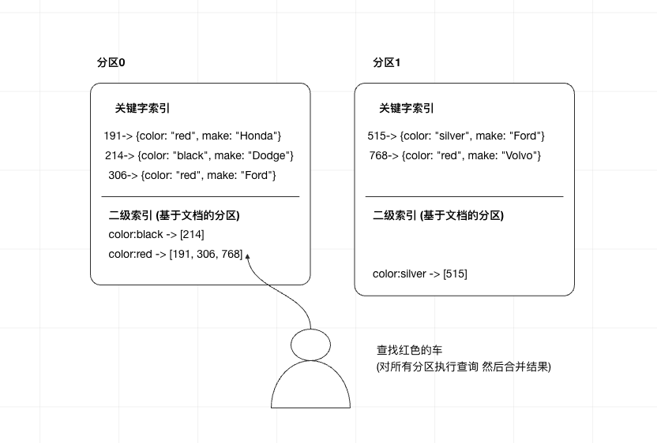

例如将颜色字母字母从a-m的二级索引都放在一个分区

但是这个会增加写扩大, 一个分区的原始数据需要更新时, 可能涉及到多个分区的二级索引进行写操作

实践中, 全局二级索引的更新通常是异步的

## 分区再平衡

分区再平衡通常至少满足

1. 平衡之后, 负载、数据存储、读写请求在集群内应该更均匀的分布
2. 再平衡的过程中, 数据库应该正常提供服务
3. 避免不必要的迁移, 以加快动态再平衡, 也尽量减少网络和磁盘I/O的影响

## 动态再平衡策略

1. 最好将哈希值划分为不同的区间范围, 然后将每个区间分配给一个分区
2. 不建议使用取mod, 因为节点数变化, 会导致很多关键字的数据所在分区变化

### 固定数量的分区

步骤

1. 创建远超实际节点数的分区数
2. 为每个节点分配多个分区
3. 根据关键字哈希范围分配到不同区

例如, 一个只有10个节点的集群, 数据库一开始就划分1000个分区, 每个节点承受100个分区

如果新增节点, 该新节点从现有每个节点匀走几个分区, 直到再次达到全局平衡

劣势:
使用该策略时, 要确认数据集的总规模高度

### 动态分区

对于采用的关键字分区的数据库, 如果边界设置有问题, 可能所有数据都在一个分区里

大于数量阈值则分裂, 小于数量阈值则合并. 可以设置初始最小分区

### 按节点比例分区

每个节点具有固定数量的分区, 当节点数不变时, 每个分区的大小和数据集大小保持正比增长关系

当节点数增加时, 分区则会调整变小

1. 当一个新的节点加入集群, 他随机选择固定数量的现有分区进行分裂, 拿走这些分区的一半数据量

## 请求路由

方案一: 允许客户端链接任意节点, 如果某节点拥有所请求的分区, 则直接处理, 否则转发到下一个合适的节点
方案二: 所有客户端请求都发送到一个路由层, 由路由层决策转发到哪个分区
方案三: 客户端感知分区与节点分配关系

# 7 事务

## ACID含义

1. 原子性: 要么都成功要么都失败
2. 一致性: 达到预期状态
3. 隔离性: 两个客户端同时++, 要达到加两次的效果
4. 持久性: 事务提交成功, 即使数据库崩溃也要保证数据不丢失

## 弱隔离级别

### 读-提交

- 读数据库时, 只能看到已提交的数据(防止"脏读"")
- 写数据库时, 只会覆盖已成功提交的数据(防止"脏写")

#### 防止脏写

- 脏写: 如果两个事务同时尝试更新相同对象, 如果先写但未提交的事务被后写的覆盖了, 则是脏读

避免脏读的方式是推迟第二个写请求, 直到前面的事务全部完成

#### 实现读-提交

脏写: 数据库一般采用行锁来防止脏写

脏读: 对于每个待更新的对象, 数据库维护旧值、当前持有锁将要设置的新值两个版本, 事务提交后, 能读到新值

### 快照级别隔离与可重复读

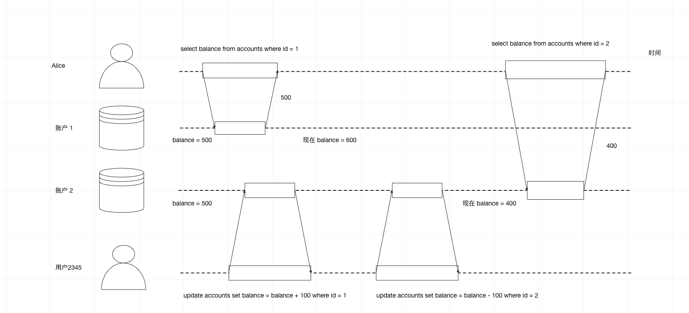

alice可能在同一界面上看到账户1为500, 账户2为400, 少了100元. 但过几s后 刷新, 就会变成 账户1为600, 账号2为400

以下场景不能容易暂时的不一致性

1. 备份场景: 备份场景要备份整个数据库, 可能包含部分旧数据 部分新数据
2. 分析查询与完整性检查场景: 定期检查数据完整性

快照隔离手段: 每个事务都从数据库的一致性快照中读取, 事务一开始所看到的是最近提交的数据, 即使数据随后被另外一个事务被修改, 但保证每个事务都只看到该特定时间点的旧数据

#### 实现快照级别隔离

脏写: 数据库一般采用行锁来防止脏写

脏读:MVCC(多版本并发控制)

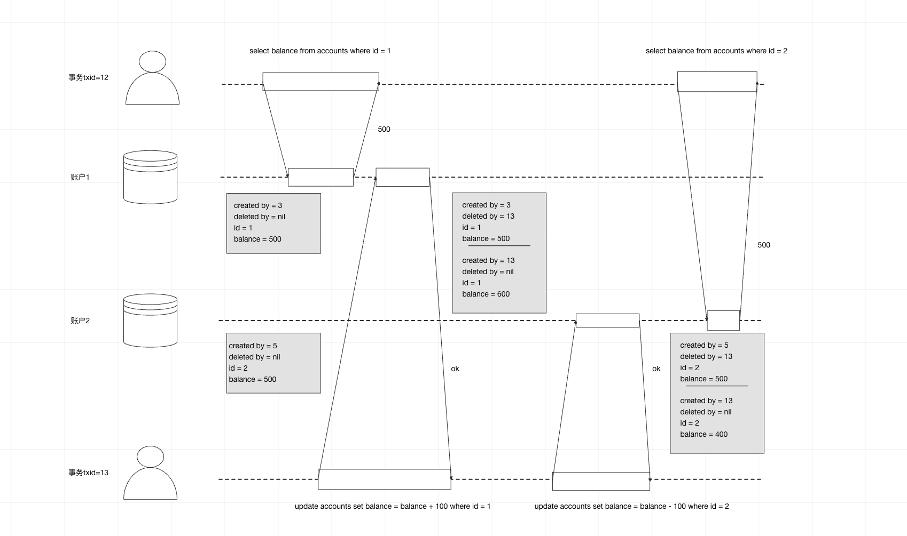

确认没有其他事务引用该标记的删除的行时, 数据库的垃圾回收会去真正删除并释放空间

#### 一致性快照的可见性规则

1. 每笔事务开始时, 数据库列出所有当时尚在进行中的事务, 然后忽略这些事务完成的写入, 则不可见
2. 所有中止的事务所有修改全部不可见
3. 较晚事务ID(晚于当前事务)所做的任何修改不可见, 不管这些事务是否完成了提交
4. 除此之外, 其他所有写入都对应用查询可见

#### 索引与快照级别隔离

### 防止更新丢失

场景: 应用程序从数据库读取某些值, 根据应用逻辑做出修改, 然后写回新值

case:

1. 递增计数器
2. 对某复杂对象的一部分内容执行修改
3. 两个用户同时编辑wiki页面, 且每个用户都尝试将整个页面发送至服务器

#### 原子写操作

```sql
update counters set value = value + 1 where key = 'foo';
```

#### 显示加锁

如果数据库不支持内置原子操作, 则读取时显示加锁

例如移动球游戏, 移动前还有检查其他玩家和球的状态,才能更改

```sql
begin transaction
select * from figures where name = 'robot' and game_id = 222 for update;
...
update figures set position = 'c4' where id = 1234;
commit
```

#### 原子比较和设置

```sql
update wiki_pages set content = 'new content' where id =1234 and content = 'old content'
```

但是假如是其他事务修改的内容, 本事务可能检查不到变化而防御无效

#### 冲突解决与复制

如果支持多主, 原子比较和加锁都不再适用, 需要采用冲突解决策略(多版本合并或最后更新获胜)

### 写倾斜和幻读

case: 每个科室每个时间段都安排两个值班医生, 医生不适可以请假, 但是保证科室至少有一个医生值班, 如果两个医生同时点请假, 因为快照级别隔离, 两个检查都是返回两个医生, 结果两个医生都请假了

#### 定义写倾斜

这种异常现象就叫写倾斜

这种需要对事务依赖的行显式加锁

```sql
begin transaction;
select * from doctors where on_call = true and shift_id = 1234 for update;
update doctors set on_call = false where name = 'Alice' and shift_id = 1234;
commit
```

#### 为什么产生写倾斜

1. 输入匹配条件, select 查询出所有满足的行
2. 根据查询结果, 应用层代码决定下一步操作
3. 应用层决定继续执行, 发起数据库写入

#### 实体化冲突

对于上述值班case, 还可以有行进行加锁解决写倾斜问题, 但是例如会议室预定写倾斜问题, 因为没有行存在, 所以没办法这样操作.

所以可以引用一些加锁对象, 例如构建时间-会议室表, 我们提前就创建了接下来6个月可能得房间和时间的组合

这种方法叫做实体化冲突, 但是不太建议使用, 并不优雅

### 串行化

可串行化的数据库实现

1. 严格按照串行顺序执行
2. 两阶段加锁
3. 乐观并发控制技术, 例如可串行化的快照隔离

#### 实际串行执行

一个线程按顺序方式每次只执行一个事务, 例如redis

### 两阶段加锁

多个事务读取同一对象

1. 事务A已经读取了某对象, 此时事务B想要写入该对象, B必须等A事务提交
2. 事务A已经修改对象, 事务B想读取该对象, 那么B必须等A完成了提交

#### 实现二阶段加锁

1. 数据库想要读取对象, 必须先获得共享锁, 可以有多个事务获得一个对象的共享锁, 但如果某个事务已经获得独占锁, 则其他事务都需要等待
2. 如果事务需要修改对象, 必须获得独占锁, 不允许多个事务获得独占锁, 其他事务获得共享/独占都需要此独占锁释放
3. 事务先读取对象获得共享锁, 后面尝试写入对象, 需要升级为独占锁
4. 获得锁之后, 一直持有到事务结束

#### 谓词锁

谓词锁会限制如下访问

1. 如果事务A想要读取某些满足匹配条件的对象, 例如采用select查询, 他必须以共享模式获得查询条件的谓词锁, 如果另一个事务正持有任何一个匹配对象的互斥锁, 那么A必须等到B释放锁了才能继续执行查询
2. 如果事务A想要插入、更新、删除对象, 则必须首先检查所有旧值和新值是否与现有的任何谓词锁匹配(冲突), 如果B持有这样的谓词锁, 那么A必须等到B完成提交后才能继续

关键点在于, 谓词锁可以保护数据库那些还不存在但可能马上被插入的对象

#### 索引区间锁

谓词锁性能较差, 通过索引区间锁来简化谓词锁, 会使保护对象扩大

对于会议室预定的数据库, 通常会在room_id创建索引, 或在start_time和end_time上有索引

假如索引位在root_id上, 数据库会使用索引查找123号房间的预定情况, 简单地把共享锁附加在此索引类目

如果索引位建在start_time上, 数据库通过索引查找预定, 则可以将共享锁加到该时间范围内的所有会议室

如果没有合适的索引, 数据库会回退到对整个表加共享锁


### 可串行化的快照隔离(SSI)

#### 基于过期的条件做决定

数据库如何知道查询结果是否发生了改变呢

1. 读取是否作用于一个(即将)过期的MVCC对象(读取之前已经有未提交的写入)
2. 检查写入是否影响即将完成的读取(读取之后, 又有了新的写入)

#### 检查是否读取了过期的MVCC对象


当事务提交时, 数据库会检查存在一些当初被忽略的写操作现在完成了提交, 如果是则必须中止当前事务

#### 检测写是否影响了之前的读

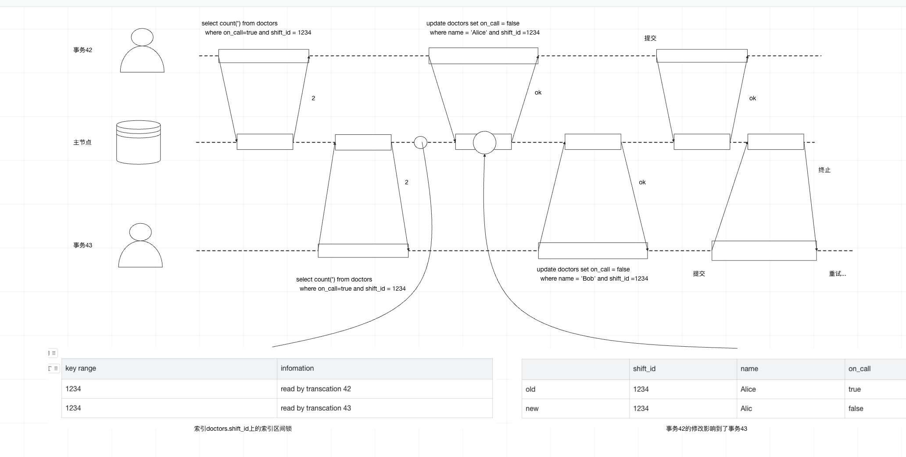

SSI锁跟索引区间锁类似, 但是SSI锁不会阻塞其他事务

虽然42跟43互相影响了, 但是43先提交所以可以成功

跟二阶段加锁串行执行相比,SSI更难容忍慢事务

# 8 分布式系统的挑战

## 知识, 真相和谎言

### Fencing令牌

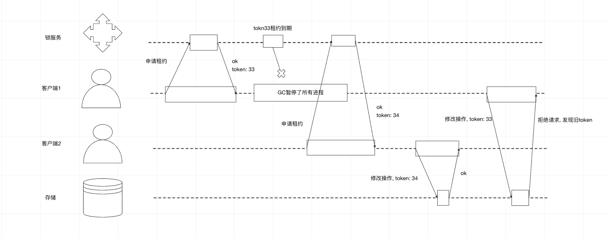

# 一致性与共识

## 可线性化

在最终一致性数据库中, 同时查询两个不同的副本可能会得到不同的答案, 如果数据库能够对上提供只有单个副本的假象, 情况会不会简化? 这就是可线性化

## 如何达到线性化

寄存器操作

1. read(x) => v: 读取x的值
2. write(x, v) => r: 将x设置为v, 数据库返回处理结果r(成功/失败)
3. cas(x, v_old, v_new) => r: 当x的值为v_old时, 设置值为v_new, 否则失败

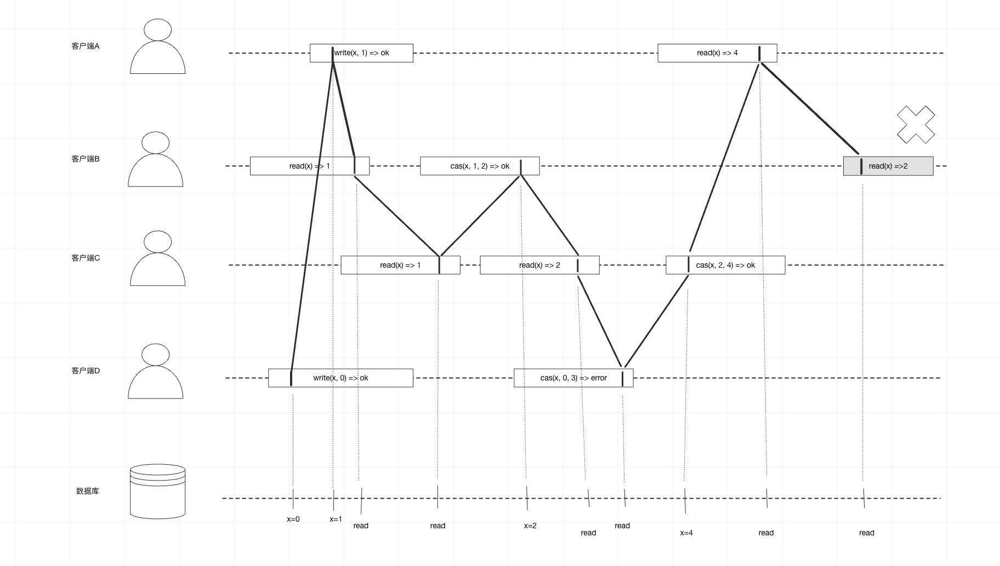

客户端read应该是4, 而服务器返回了2,所以不满足线性化

## 实现线性化系统