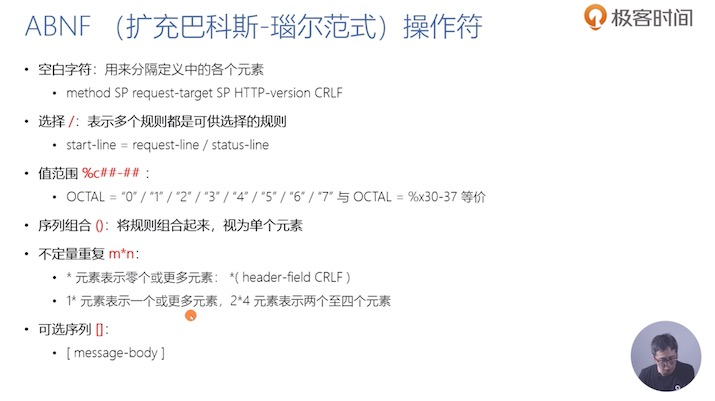
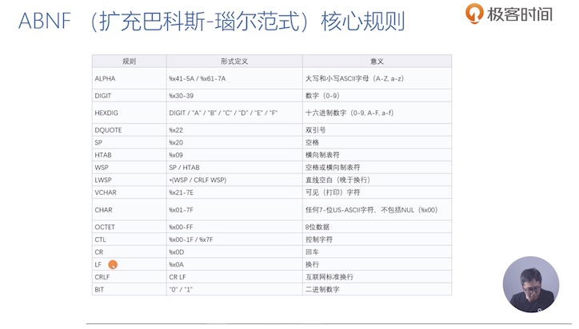
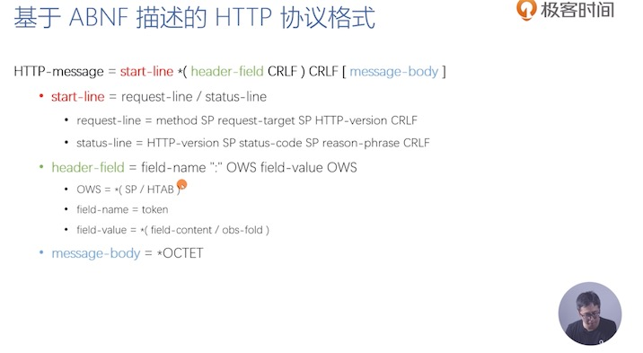
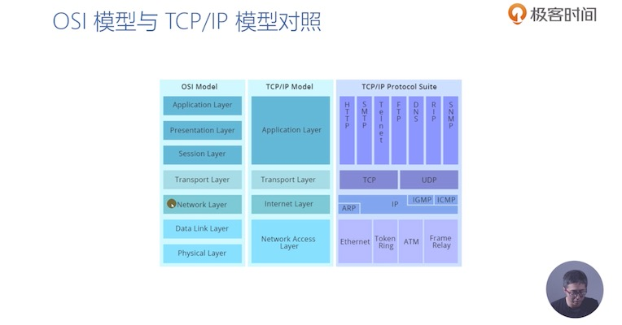
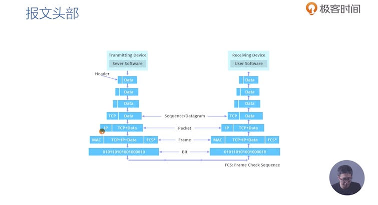
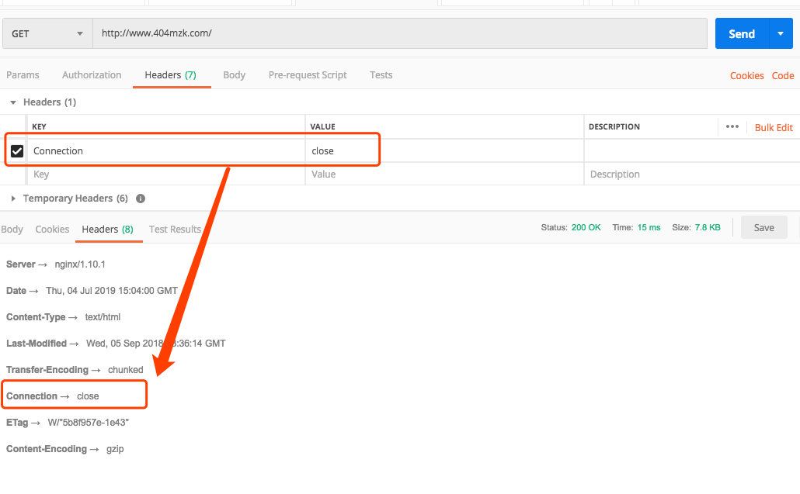

# web协议详解与抓包实践

# 4 ABNF语义定义的HTTP消息格式

这一章主要介绍RFC文档中描述HTTP规则的语法

# 5 网络为什么要分层 OSI网络模型与TCP/IP模型

OSI Open System Interconnection Reference Model概念模型

- 应用层 HTTP/P2P/FTP/telnet
- 表示层 把网络层的消息转化成应用层能读取的消息 TLS/SSL协议就是工作在表示层
- 会话层 完全概念化的一层 建立会话 握手 维持连接关闭, 其实这个层有部分工作是表示层和传输层做的, 所以这一层是纯概念化的一层
- 传输层 TCP协议/UDP协议 解决的是进程与进程之间的通讯, 例如一个网络请求来了 主机应该把这个请求分发给哪个进程, 这一层还做了更多的事情, 例如TCP 保证了请求的可达性, 流量的控制
- 网络层 IP协议, Inter网 在广域网中, 可以从一个主机上发报文到另一个主机上
- 数据链路层 在局域网中 我们使用Mac地址连接到相应的交换机/路由器  就可以把报文转到另一个主机上 只工作以太网这样的局域网上 
- 物理层

OSI模型与TCP/IP模型的对照

分层的好处是, 每个层做更新 可以不影响到其他层

而坏处就是 每一层的转发其实都是性能的消耗

# 7 评估Web架构的7大属性

- 性能
- 可伸缩性: 支付部署可以互相交互的大量组件
- 简单性: 易理解 易实现 易验证
- 可见性: 对于两个组件间的交互进行监视和仲裁的能力
- 可移植性: 在不同环境下运行的能力
- 可靠性: 出现部分故障 对整体影响的程度
- 可修改性: 修改的难易, 由进化性, 可定制性, 可扩展性, 可配置性, 可重用性构成

> 性能

网络性能

- 吞吐量: 小于等于带宽
- 开销: 首次开销 每次开销

用户感知到的性能

- 延迟: 发起请求到接收到响应的时间
- 完成时间: 完成一个应用动作所花费的时间

网络效率

- 重用缓存、减少交互次数、数据传输距离更近、COD(按需代码)

> 可修改性

- 可进化性: 一个组件独立升级而不影响其他组件
- 可拓展性: 向系统添加功能, 而不影响到其他系统的其他部分
- 可定制性: 临时性、定制性的修改某一要素来提供服务, 而不对常规用户产生影响
- 可配置性: 应用部署后修改配置提供新的功能
- 可重用性: 组件不做修改再在其他应用再使用

# 从5种架构风格推导出HTTP REST

### 5种架构风格

> 数据流风格 

例如7层网络分层 就是数据流风格 

优点: 简单性 可进化性 可拓展性 可配置性 可重用性

管道与过滤器, 每个Filter都有输入端和输出端 只能从输入端读取数据处理完从输出端产生数据 

> 复制风格流

多个进程提供相同的服务, 通过反向代理对外提供集中服务

例如Mysql 冷热备份

还有缓存, 复制请求的结果 为后续的请求复用

> 分层风格

- 客户端服务器 Client-Server
- 分层系统: 每一层为其之上的层服务, 并用在其下层所提供的服务, 例如TCP/IP
- 分层客户端服务器: 正向代理+反向代理, 从空间上分为外部层和内部层
- 无状态、客户端服务器: 基于Client-Server, 不允许服务商有session state会话状态, 因为可见性会导致数据重复发送
- 缓存、无状态、客户端服务器: 用缓存来解决无状态带来的性能消耗
- 分层、缓存、无状态、客户端服务器

> 分层风格二

- 远程会话: CS变体, 服务器保存Apllication state应用状态, 可伸缩性、可见性差
- 远方数据访问: Application state同时存在于客户端和服务器, 例如mysql命令访问数据库, 几百万数据, 而客户端可以一页页查看 因为游标同时存在于客户端和服务器

> 移动代码风格

- 虚拟机: 分离指令和实现
- 远程求值: 基于CS的VM, 将代码发送至远程服务器执行
- 按需代码: 服务器在响应中发回处理代码, 在客户端执行 
- 分层、按需代码、缓存、无状态、客户端服务器
- 移动代理: 相当于远程求值+按需代码的结合

> 点对点风格

- Event-based Integration: 基于事件集成系统, 例如kaffa这样的消息系统, 优秀的可重用性,可拓展性, 可进化性, 但缺点是缺乏可理解性, 由于消息广播等因素造成的消息风暴, 可伸缩性差
- C2: 一带而过
- DO: 一带而过
- BDO: 一带而过

 # 09-如何用Chrome的Network分析网络报文

 过滤器使用技巧

- 选择过滤多种文件类型: 按ctrl|command 点击则多选
- domain: 仅显示指定域名 可用*来匹配多个子域名
- has-reponse-header: 显示指定HTTP响应标头的资源
- `is:` is:running表示查找WebSocket资源, is:from-cache表示查找缓存读出的资源
- lager-than: 显示大于指定大小的资源(单位为字节)
- method: 显示指定的HTTP请求方法
- mime-type: 显示指定MIME类型(CONTENT-TYPE)
- schme: 筛选协议一般写http|https
- set-cookie-domain: 显示具有Set-Cookie请求头并且domain要匹配, 类似的还有set-cookie-name,set-cookie-value
- state-code: 显示指定状态码资源

多属性用空格实现AND操作

> 查看资源是哪个资源引发的

按shift hover到资源名称(A)上

- 其他资源为红色的表示这些资源由A发起的请求
- 其他资源为绿色的表示这个资源是发起了A资源请求的

> 浏览器加载时间

- 解析HTML结构
- 加载JS和CSS
- 解析并执行脚本
- DOM构建完成
- 加载图片
- 页面加载完毕

> 请求时间详细分部

- Queueing: 资源正在排队
 - 存在更高优先级的资源
 - 浏览器已打开6个TCP连接, 仅限HTTP1.0/HTTP1.1
 - 浏览器正在分配磁盘空间
- Stalled: 请求可能会因为Queueing中的原因而停止
- DNS Loopup: DNS解析时间
- Proxy Negotiation: 浏览器正在与代理服务器协商请求
- Request Send: 正在发送请求
- ServiceWorker Preparation: 浏览器正在启动ServiceWork
- Request to ServiceWork: 正在请求发送到ServiceWork
- Wating(TTFB): 浏览器正在等待响应的第一个字节时间(1次往返+服务器响应时间)
- Content Download: 浏览器正在接受响应
- Receiving Push: 浏览器通过HTTP2.0服务器推送接受数据
- Reading Push: 浏览器正在读取之前收到的本地数据

# 10 URI的基本格式和URI的区别

- URL: 资源具体的位置
- URN: 例如magent:?xt=urn:sha1:YNCHXXXXX, 期待为资源提供持久的, 位置无关的标识方式, 并允许将多个命名空间映射到单个URN的命名空格

# 11 为什么要对URI进行编码

- 传递数据中, 如果存在分隔符的保留字怎么办
- 对可能产生歧义性的数据编码
 - 不在ASCII编码的字符
 - URI中规定的保留字
 - 不安全字符 如空格、引号、尖括号等

URI百分号编码

- 非ASCII编码, 建议先UTF8编码 再US-ASCII编码
- 对于URI合法字符: 编码与不编码的效果是一致的

不同的语言可能对URI编解码的实现不同

# 12 详解HTTP请求行

> 请求方法

- GET: 主要获取信息的方法 幂等方法
- HEAD: 类似GET, 但不发送BODY, 用于获取HEAD元数据 幂等方法
- POST: 常用于新增资源
- PUT: 更新资源, 带条件时是幂等方法
- DELETE: 删除资源, 幂等方法
- CONNECT: 建立tunnel隧道
- OPTIONS: 显示服务器对访问资源支持的方法

> 用于文档管理的WEBDAV方法(TFC2518)

- PROPFIND: 从Web资源从检索以XML格式存储的属性, 可以用来检索远程系统的目录层次结构
- PROPPATCH: 在单个院子性动作中更改和删除资源的多个属性
- MKCOL: 创建集合或者目录
- COPY: 将资源从一个URI复制到另一个URI
- MOVE: 将资源从一个URI移动到另一个URI
- LOCK: 锁定一个资源, WEBDAV支持共享锁和互斥锁
- UNLICK: 解除资源锁定

# 13 HTTP的正确响应码

> 响应码分类 1xx

- 1xx表示请求已收到, 但需要进一步处理才能完成, HTTP1.0不支持
 - 100 Continue: 上传大文件前使用, 由客户端请求中携带Expect: 100-continue头部触发
 - 101 Switch Protocols: 协议升级使用, 由客户端发请请求中携带Upgrade头部触发, 例如升级websocket或者http/2.0
 - 102 Processing: WebDAV请求可能包含很多文件操作, 需要很长时间才完成 该代码表示服务器已接受到请求, 但无响应可用, 这样可以防止客户端超时, 并假设请求丢失

> 响应码分类 2xx

- 2xx: 成功处理请求
 - 200 OK: 成功返回响应
 - 201 Created: 有新资源在服务器端被成功创建
 - 202 Accpted: 服务器接收并开始处理请求, 但请求未完成
 - 203 Non-Authoritative Information: 当代理服务器修改了origin server的原始响应宝体时, 代理服务器可以通过此状态码告诉客户端, 203响应可以被缓存
 - 204 No Content: 成功执行了请求且不携带响应包体, 但客户端可以无需更新视图
 - 205 Reset Content: 成功执行了请求且不携带响应包体, 但客户端需要更新视图
 - 206 Partial Content: 使用range协议返回部分响应内容时的响应码
 - 207 Multi-Status: RFC4918, 在WEBDAV协议中以XML返回多个资源的状态
 - 208 Already Reported: RF5842, 在避免相同集合在207响应码下重复上报, 使用208可以使用父集合的响应码 

> 响应码中的 3XX

- 3xx: 重定向使用Location指向的资源或者缓存中的资源, 在RFC2068中规定客户端重定向次数不应超过5次, 以防止死循环
 - 300 Multiple Choices: 资源有多种表述, 通过300返回给客户端后由其自行选择哪一种表述进行访问
 - 301 Move Permanently: 资源永久重定向到另一个URI中
 - 302 Found: 资源临时的重定向到另一个URI中
 - 303 See other: 重定向到其他资源, 常用于Post/PUT等方法的响应中
 - 304 Not Modified: 当客户端有可能过期的缓存时, 会携带缓存的标识etag, 时间等信息询问服务器缓存是否可复用, 而304是告诉客户端缓存可复用
 - 307 Temporary Redirect: 类似302, 但明确重定向后请求方法必须与原请求方法相同, 不得改变
 - 308 Permanent Redirect: 类似301, 但明确重定向后请求方法必须与原请求方法相同, 不得改变

# 14 HTTP的错误响应码

- 400: 客户端出现错误
 - 400 Bad Request: 服务器认为客户端请求错误, 但服务器无法判断是哪种错误 则返回400, 例如HTTP请求格式错误
 - 401 Unauthorized: 用户认证信息缺失或者不正确
 - 407 Proxy Authtication Required: 对需要经由代理的请求, 认证信息未通过代理服务器验证
 - 403 Forbidden: 服务器没有权限执行此请求
 - 404 Not Found: 服务器没找到对应资源
 - 410 Gone: 服务器没找到服务器, 且明确的知道该位置永久性找不到该资源
 - 405 Method Not Allowed: 服务器不支持请求行中的method方法
 - 406 Not Acceptable: 对客户端指定的资源表示不存在的(例如语言|编码有要求), 并把可选择列表返回给客户端
 - 408 Request Timeout: 服务器接受请求超时
 - 409 Conflict: 资源冲突, 例如上传文件时且该位置已存在版本更新的资源
 - 411 Length Required: 如果请求含有包体且未携带 Content-length头部, 且不属于chunks类请求 返回411
 - 412 Precondition Failed: 复用缓存时传递的If-Unmodified-Since或If-None-Match头部不被满足
 - 413 Payload Too Large: 请求包体超出服务器能处理的最大长度
 - 414 URI Too Long:请求URI超过服务器所能接受的长度
 - 415 Unsupported Media Type: 上传的文件类型不被服务器接受
 - 416 Range Not Satisfiable: 无法提供Range请求中指定的那段包体
 - 417 Expectation Failed: 对于Expect请求头部期待的情况无法满足时的响应码
 - 421 Misdirected Request: 服务器认为这个请求不该发给它, 因为它没能力处理
 - 426 Upgrade Required: 服务器拒绝基于当前HTTP协议提供服务, 通过Upgrade头部告诉客户端必须升级才能处理
 - 428 Precondition Required: 用户请求中缺少条件类头部, 例如If-Match-
 - 429 Too Many Request: 客户端发送请求速度过快
 - 431 Request Header Fields Too Large: 请求的HEADER头部大小超过限制
 - 451 Unavailable For Legal Reasons: RFC7725, 由于法律原因不可访问

> 500 服务器出现错误

|错误码|解释|
|---|---|
| 500 Internal Server Error | 服务器内部错误, 且不属于以下错误类型|
| 501 Not Implemented | 服务器不支持请求所需的功能|
| 502 Bad Geteway | 代理服务器无法获取到合法响应|
| 503 Service Unavailable | 服务器资源尚未准备好处理当前请求 |
| 504 Getway Timeout | 服务器无法及时响应 |
| 505 Http Version Not Support | 请求使用的HTTP协议版本不支持|
| 507 Insufficient Storage | 服务器没有足够的空间处理请求|
| 508 Loop Detected | 访问资源时检测到循环|
| 511 Network Authentication Required | 代理服务器发现客户端需要进行身份验证才能获得网络访问权限|

统一规则, 服务器无法判断错误原因, 都返回x00的错误码

# 15 如何管理跨代理服务器的长短连接

这里跟HTTP权威指南第四章讲得很像 所以也可参考阅读

http://read.404mzk.com/http_power_book.html#4-%E9%93%BE%E6%8E%A5%E7%AE%A1%E7%90%86

> 长连接和短连接的区别

短连接 在处理请求的时候, 必须每执行完一个请求 都关闭连接 然后再起新的连接 执行新的请求

长连接 在处理请求时 一个TCP连接 可以串行的执行新的请求 但不必关闭请求

> 客户端与服务器协商使用长连接

客户端在请求头带 Connection: Keep-Alive

服务器响应头也带 Connection: Keep-Alive

HTTP1.1中 默认支持长连接的 所以不带Connection:Keep-Alive

ps: 但是笔者看了chrome 虽然是1.1 但也都是带Connection了 为了统一规范性

客户端/服务器明确不使用长连接 就声明 Connection: Close

其实很少客户端会明确请求头声明Connection: Close

随意笔者测了一下 请求头戴Connection:Close 看服务器是否会返回响应头 Connection: Close

果然 服务器返回了Connection: Close

Connection还有一个作用就是

代理服务器不要转发Connection中声明的头部

例如Connection: cookie

假设场景是 客户端A->代理服务器B->代理服务器C

则表示 请求头cookie 只传到代理服务器B, 而代理服务器B 不要把我的cookie传到代理服务器C

> Connection 仅对当前连接有效

例如 客户端A->代理服务器B->代理服务器C

这样的话 客户端请求头带 Connection: Keep-Alive的话 只代表客户端A想和代理服务器B做长连接

而客户端A对整条链路后面的代理服务器并没有请求Connection的权利

这里前提是 代理服务器B认识Connection头 不然它只会把Coneection透传下去

> Proxy-Connection解决了什么问题

参考书 HTTP权威指南4.5.7 插入Proxy-Connection

# 16 HTTP消息在服务器端的路由

 为了防止陈旧代理服务器

 发向正向代理的请求 request-target必须以absolute-from的形式出现

RFC7230规定 必须发送Host|发送多个HOST请求头|HOST格式错误 否则返回400

- TCP连接
- 接受请求
- 根据HOST和端口寻找虚拟主机 
- 寻找URI处理代码
- 执行处理请求的代码
- 生成HTTP响应
- 发送HTTP响应
- 记录访问日志

# 17 代理服务器转发消息时相关的头部

多次正向代理反向代理后, 服务器如何拿到用户真正的IP

假设用户经过的代理服务器IP是

115.204.33.1 -> 1.1.1.1 -> 2.2.2.2

那么REF规定的头部是

到达2.2.2.2IP这台机器的时候 其请求头部会有这么一对key-value

X-Forwarded-For: 115.204.33.1, 1.1.1.1

想拿到用户的IP取第一个即可

nginx还实现了非规范的请求头

X-Real-Ip: 115.204.33.1

消息的转发

|请求头|说明|例子|
|---|---|---|
|Max-forwards| 限制Proxy代理服务器的最大转发次数, 仅对TRACE/OPTIONS生效 | Max-Forwards = 1, 每层代理服务器都会取值然后减1|
| Via | 表示经过代理服务器的名称和版本| 1.0 mzk-nginx, 1.0 mzk-apache|
| Cache-Control| 禁止代理服务器修改响应宝体| Cache-Control: no-transform|

# 18 请求与响应的上下文

> 请求上下文Referer

一个资源请求的发起, 都会给请求头加上referer, 表示这个请求从哪个请求发起的

浏览器不会放referer的情况

- data和file协议的资源
- 当前请求页面采取HTTP, 而发起的请求是HTTPS

作用

- 统计分析
- 缓存优化
- 防盗链

# 19 内容协商与资源表述

内容协商的两种方式

- Proactive主动式内容协商: 由客户端请求头描述形式, 服务器根据请求返回对应的内容
- Reactive 响应式协商: 服务器返回300表示多种选择或者406, 然后再由客户端再次发起请求(支持性差))

场景的协商要素

质量因子: q

Accept: text/html;q=0.9

> 内容编码: 主要指压缩算法

Accept-Encoding: gzip, deflate, br

> 表述语言

Accept-Language: zh-CN,zh;q=0.9,en-US;q=0.8,en;q=0.7

> 资源表述的源文件头部

- 媒体类型、编码: content-type: text/html; charset=utf-8
- 内容编码: content-encoding: gzip
- 语言: Content-Language: de-DE, en-CA

# 20 HTTP包体的传输方式(1)-定长包体

HTTP-message=start-line *(headed0field CRLF) CRLF `[message-body]`

以下消息不能有包体

- HEAD方法请求对应的响应
- 1xx, 204, 304对应的响应
- CONNECT方法对应的2XX响应

Content-length方法明确包体总长度(10进制, 包体的字节个数, 且必须与实际传输包体长度一致)

优点: 接收端处理简单

# 21 HTTP包体的传输方式(2)-不定长宝体

- 使用Transfer-Encoding头部指明使用chunk传输方式(含Transfer-Encoding头部后Content-Length将会被忽略)

优点

- 基于长连接持续推送动态内容
- 压缩体积比较时, 不必完全压缩完(计算头部)再发送, 可以边发送边压缩
- 传输必须在包体传输完才能计算出Trailer头部

Transfer-conding = chunked | compress | deflate | gzip | transfer-extension

Transfer-Encoding: chunked

chunked-body = * chunk
                last-chnk
                trailer-part
                CRLF

chunk = chunk-size [chunk-ext] CRLF chunk-data CRLF

chunk-size 是16进制

last-chunk = 1*("0") [chunk-ext] CRLF

trailer-part= *(header-field CRLF)

> Trailer头部传输

- 客户端必须表明接受Trailer头部: TE: trailers
- 服务端必须在刚开始就告诉客户端会在后面携带哪些头部 Trailer: Date
- 并不是所有trailer-part都允许出现在Trailer头部, 例如Transfer-Encoding和Content-length, Host, Cache-control, Set-Cookie等

> Content-Disposition

- inline: 包体以内联的方式, 作为页面的一部分展示
- attachment: 指定浏览器将包体以附件的方式下载, Content-Disposition: attachment; name="fileName.jpg";
- disp-ext-type: 例如在multipart/form-data类型应答中,1 用于子消息体部分 Content-Disposition: form-data; name="fileName.jpg"

# 22 HTML FROM表单提交时的协议格式

enctype: 在POST方法下 对表单内容在请求包体中的编码格式

- application/x-www-form-urlencoded: 数据编码成以`&`分隔的键值对, 同时用=分隔key和value, 字符以URL编码方式进行编码
- multipart/form-data: 
 - boundary分隔符
 - 每部分表述皆有HTTP头部描述子包体, 例如content-type
 - last boundary结尾

每部分包体格式 encapsulation = delimiter body-part CRLF

- delimiter = "--" boundary CRLF
- body-part = fields *(CRLF *text)
  - field = field-name ":" [ field-value] CRLF
    - content-disposition: form-data; name="xxxx"
- close-delimiter = "--" boundary "--" CRLF

# 23 断点续传与多线程下载是如何做到的

服务器通过Accept-Range头部表示是否支持Range请求

Accept-Ranges: bytes //支持

Accept-Ranges: none //不支持

> Range请求范围的单位

基于字节 假设总长为10000

第一个500字节 bytes=0-499

第二个500字节

- bytes: 500-999
- bytes: 500-599,601-999

最后一个500字节

- bytes: -500
- bytes: 9500-

第一个和最后一个字节

byres=0-0,-1

